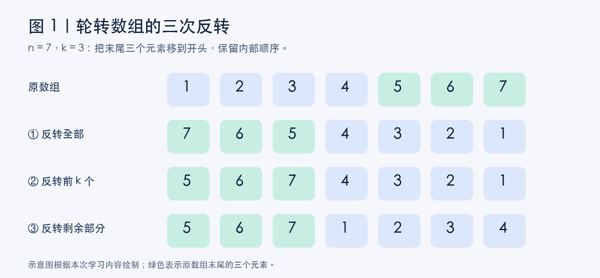
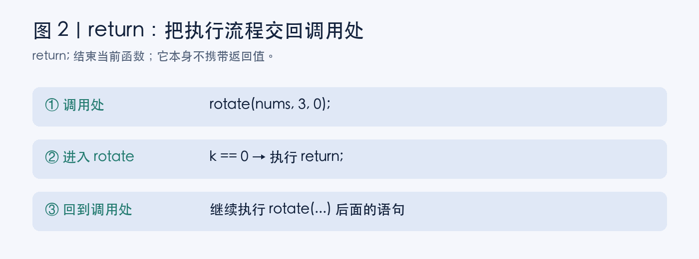
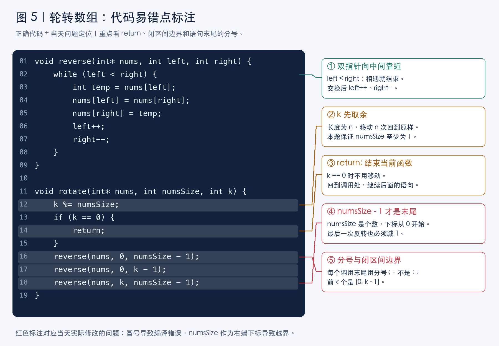
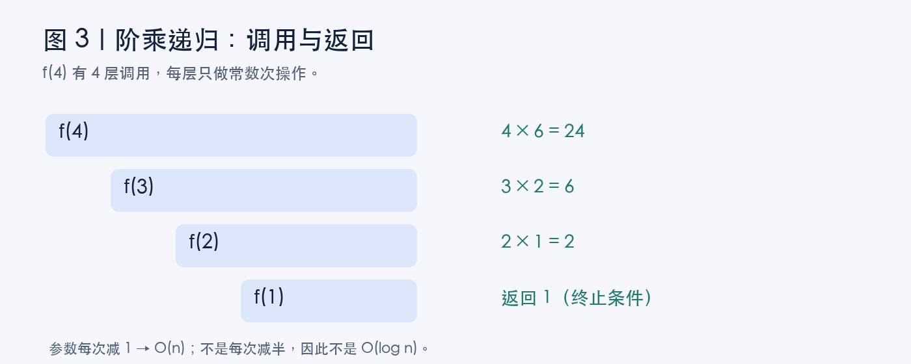
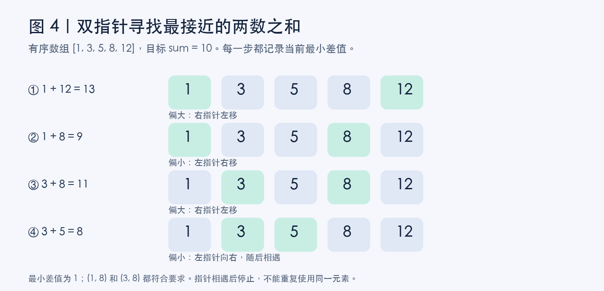
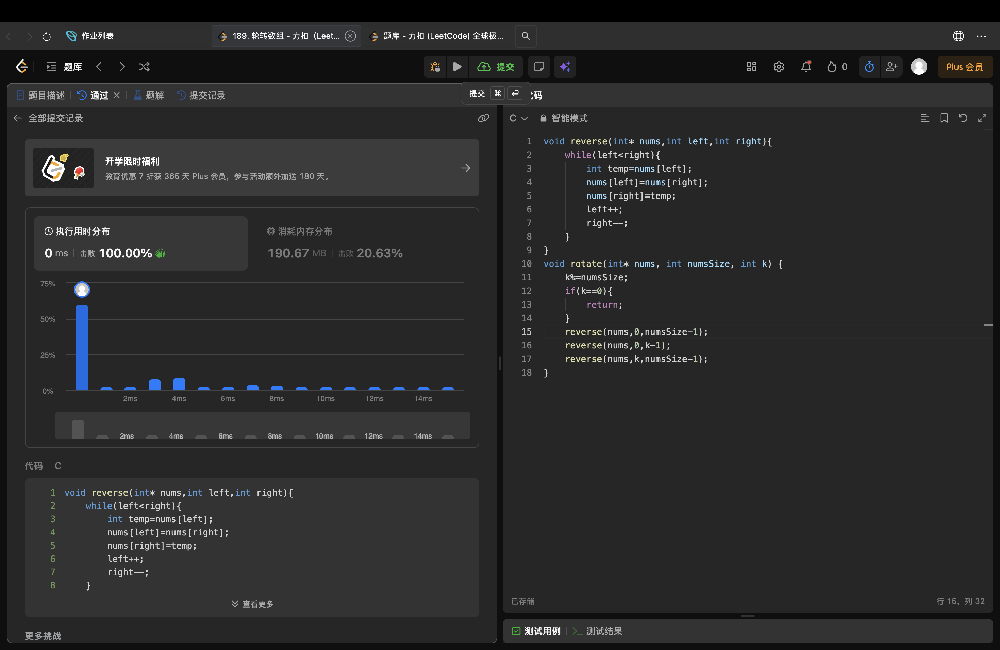

# 从知识点到错题复盘：C 语言数组、递归与时间复杂度

> 学习日期：2026 年 9 月 10 日。复习顺序：先理解知识点，再看当天四道题与自己的作答，最后核对逐题解析。文中包含五张自制示意图、一张原始提交截图和八个自测问题，图片均注明用途。

今天的疑问集中在几个地方：return 究竟回到哪里、数组为什么要减 1、递归执行了多少次，以及为什么二分查找不一定让整个算法更快。先把这些基础连接起来，再回头看题目。

## 一、先学知识点

### 0. 如何分析时间与空间复杂度

时间复杂度关注输入规模 n 增大时，基本操作次数怎样增长；额外空间复杂度关注辅助存储怎样增长。它们都不是平台显示的具体毫秒数或内存读数。

分析时先分清：一段代码执行一次要多少工作，总共又执行了多少次。顺序执行的两段循环把工作量相加，嵌套且每层都走满 n 次的两层循环才会相乘。递归还要考虑调用层数，以及每层产生几次递归调用。

| 典型过程 | 常见时间复杂度 | 判断依据 |
| --- | --- | --- |
| 固定次数的赋值、比较 | O(1) | 次数不随 n 增长 |
| 扫描 n 个元素 | O(n) | 每个元素处理常数次 |
| 每次排除一半候选 | O(log n) | 规模逐次减半 |
| 对每个元素都做一次二分 | O(n log n) | n 次 × 每次 O(log n) |
| 枚举所有不同数对 | O(n²) | 约 n(n−1)/2 个组合 |

### 1. 数组、反转与轮转


题目要求把数组向右轮转 `k` 个位置。例如：

```text
原数组：[1, 2, 3, 4, 5, 6, 7]
k = 3
结果：  [5, 6, 7, 1, 2, 3, 4]
```

如果每次只移动一格，就要先保存最后一个元素，再把其他元素往右挪，最后把保存的元素放在开头。每次需要 `O(n)`，重复 `k` 次就是 `O(nk)`。

更高效的办法是三次反转：先反转整个数组，再反转前 `k` 个元素，最后反转剩下的元素。



*图 1：绿色方块表示原数组末尾的三个元素。先交换两部分的位置，再恢复各自内部的顺序。图片为学习示意图。*

把数组分成 `A = [1,2,3,4]` 和 `B = [5,6,7]`，目标就是把 `AB` 变成 `BA`。整体反转后得到“倒序的 B + 倒序的 A”，分别再反转一次，就得到目标。

完整 C 代码如下：

```c
// 反转闭区间 [left, right]，包含左右两端。
void reverse(int* nums, int left, int right) {
    while (left < right) {
        int temp = nums[left];
        nums[left] = nums[right];
        nums[right] = temp;
        left++;
        right--;
    }
}

void rotate(int* nums, int numsSize, int k) {
    // 本题保证 numsSize >= 1，k >= 0。
    k %= numsSize;
    if (k == 0) {
        return;
    }

    reverse(nums, 0, numsSize - 1);
    reverse(nums, 0, k - 1);
    reverse(nums, k, numsSize - 1);
}
```

`k %= numsSize` 是因为移动一整圈会回到原样。例如长度为 7，右移 10 次等价于右移 3 次。

三次反转加起来仍然只处理线性数量的元素，所以时间复杂度是 **O(n)**；只使用几个辅助变量，额外空间复杂度是 **O(1)**。


### 2. 函数调用与 return


```c
if (k == 0) {
    return;
}
```

当 `k == 0` 时，数组不需要移动，答案已经在原数组里了。`return;` 让函数立刻结束，省去后面不必要的操作。

这里需要区分两件事：

- `return;`：结束当前函数，不携带返回值，适用于这里的 `void` 函数。
- `return 0;`：结束当前函数，同时返回整数 `0`，可用于返回类型为 `int` 的函数。

“没有返回值”不意味着函数什么都没做。`rotate` 通过 `nums` 修改原数组，调用者能看到修改后的内容。

#### return 之后，程序去哪里？

回到调用这个函数的位置，继续执行调用语句之后的代码。



*图 2：当 rotate 遇到 return 时结束本次调用，调用者继续执行后面的语句。图片为执行流程示意图。*

下面的调用示例要接在上面的函数定义之后，或者提前声明 `rotate`，并在文件开头包含 `<stdio.h>`：

```c
int main(void) {
    int nums[] = {1, 2, 3};
    rotate(nums, 3, 0);  // 进入 rotate，遇到 return 后回到这里
    printf("结束了\n"); // 然后执行这一行
    return 0;
}
```

在力扣上，平台提供了调用 `rotate` 的代码，所以编辑器里通常看不到调用者。函数结束后，平台会继续检查数组内容。

对于这份三次反转实现，省略 `k == 0` 的判断也不会改变最终结果：中间的空区间不执行交换，而整个数组会反转两次。但提前返回更直接，也节省操作。


### 3. 元素个数、下标与闭区间


`numsSize` 表示元素个数，数组下标从 `0` 开始。

```text
元素：  1  2  3  4  5  6  7
下标：  0  1  2  3  4  5  6
```

有 7 个元素，最后一个下标就是 `6`，即 `numsSize - 1`。

我们定义的 `reverse` 接收的是包含两端的下标范围，所以三个区间分别是：

| 操作 | 左端下标 | 右端下标 |
| --- | --- | --- |
| 反转全部 | 0 | numsSize - 1 |
| 反转前 k 个 | 0 | k - 1 |
| 反转剩余部分 | k | numsSize - 1 |

如果把最后一个位置写成 `numsSize`，就可能访问数组范围之外的内存。C 语言不会自动保证这种访问安全，不能因为某次运行没有报错，就认为写法正确。

#### 今天遇到的两个代码错误

一个是把语句末尾的分号 `;` 写成了冒号 `:`，导致编译失败；另一个是最后一次反转把右边界写成了 `numsSize`。

它们是两类问题：前者属于语法错误，编译器能直接指出；后者是边界错误，可能通过编译，但执行时产生未定义行为。修改代码时，既要看标点，也要逐个检查区间端点。


### 易错点单图复习



*图 5：基于正确代码绘制的独立标注图。红色对应当天出现的分号和右边界错误；橙色提醒取余及提前返回的条件，不是原始提交截图。*


### 4. 递归与时间复杂度

递归是函数调用自身；必须有终止条件，并让参数逐步接近终止条件。下面以阶乘 f(n) = n × f(n−1)、f(0) = f(1) = 1 为例。

这段程序计算阶乘。以 `f(4)` 为例，调用过程是：

```text
f(4) → f(3) → f(2) → f(1)
```

到达终止条件后，结果逐层返回。



*图 3：左侧是逐层递归调用，右侧是各层计算出的返回值。图中结果只针对 n = 4。*

对正整数 `n`，大约有 `n` 层调用。每一层只做固定数量的判断、减法、乘法等操作，因此：

```text
T(n) = T(n - 1) + O(1)
     = O(n)
```

这里按基础算法题的惯例，把固定宽度整数运算看作常数时间，并在数值可表示的范围内讨论程序行为。原代码的返回类型容量有限，不适合直接计算很大的阶乘。

另外，递归需要保留尚未返回的函数调用，因此栈空间也是 **O(n)**。

我需要记住的是：**结果为 n!，不代表算法执行了 n! 次操作。** 参数每次减 1，调用次数随 `n` 线性增长；如果参数每次减半，且每层只有一次递归调用和常数额外工作，才会得到 `O(log n)`。


### 5. 大 O 表示法与复杂度化简

大 O 表示增长的渐近上界，常用化简会忽略常数系数和低阶项。例如：

```text
T(n) = 3n² + 5n + 10
通常写作 O(n²)
```

不保留 `3`，也不保留低阶项 `5n + 10`。这不表示常数对实际运行速度没有影响，只是大 O 不负责精确预测秒数。

还要补充一个严格的区别：**“最好、平均、最坏”描述分析哪一种情况；“大 O”描述增长的上界。** 最好情况、平均情况、最坏情况的时间函数，都可以用大 O 表达。课堂里常默认分析最坏情况，所以该题把“一般表示最差运行时间”视为正确，但它不是大 O 的定义。

例如线性查找：第一个元素就是目标时，最好情况是 `O(1)`；直到末尾才找到或根本不存在时，最坏情况是 `O(n)`。


### 6. 二分查找和双指针的适用方式

有序数组允许我们根据大小关系排除候选。二分查找每次排除约一半搜索区间，单次查找通常是 O(log n)；双指针在本例中从两端向内移动，用于寻找最接近目标的两数之和。

关键在于：**一次二分的复杂度，不等于整个算法的复杂度。**

如果先固定一个 `a`，确实可以二分寻找最接近 `sum - a` 的 `b`，检查插入位置附近的合法候选。但不知道哪个 `a` 最好，就需要枚举各个 `a`。因此总时间是：

```text
枚举 a：O(n)
每次寻找 b：O(log n)
整体：O(n log n)
```

这道题可以利用有序性，从数组两端设置双指针。



*图 4：绿色方块为当前指针指向的元素。目标为 10，最小差值为 1，(1,8) 和 (3,8) 都是合法答案。图片为手动推演示意图。*

设左指针为 `left`，右指针为 `right`。当 `left < right` 时，先计算当前两数之和，记录它与目标的差值，再决定移动方向：

- 当前和偏小：左指针右移，让和有机会变大。
- 当前和偏大：右指针左移，让和有机会变小。
- 当前和等于目标：差值为 0，直接结束。

为什么不会漏掉更好的答案？如果当前和已经偏大，固定当前右端元素，换成更靠右的左端元素只会让和更大；因此在记录当前组合后，可以排除这个右端元素。当前和偏小时同理：固定左端元素，右端往左只会更小，因此可以排除这个左端元素。

每一步把一个指针向内移动一格，两个指针之间的距离最多缩小 `n - 1` 次，所以总时间是 **O(n)**，额外空间是 **O(1)**。求两数之和及差值时，还应选用足够宽的整数类型，避免溢出。

| 方法 | 整体时间复杂度 | 关键原因 |
| --- | --- | --- |
| 枚举所有数对 | O(n²) | 组合数量是平方级 |
| 枚举一个数，再二分另一个数 | O(n log n) | 需要重复二分 |
| 有序数组双指针 | O(n) | 每步排除一个端点 |


## 二、当天的四道题与我的作答

下面按截图转录题干、选项和作答记录。先尝试独立判断，再查看下一部分的解析。未提供的原始选择不补写。

### 1. LeetCode 189：轮转数组

**题干：**给定一个整数数组 nums，将数组中的元素向右轮转 k 个位置，其中 k 是非负数。

```text
示例 1：nums = [1,2,3,4,5,6,7]，k = 3
输出：[5,6,7,1,2,3,4]
示例 2：nums = [-1,-100,3,99]，k = 2
输出：[3,99,-1,-100]
```

截图中的约束：数组长度为 1 到 10⁵，元素为 32 位有符号整数，0 ≤ k ≤ 10⁵。

**我的作答：**采用三次反转法。最初提交时，以下三行中有两个错误（这里特意保留错误，不能直接作为正确答案使用）：

```c
reverse(nums, 0, numsSize - 1): // 错误：末尾是冒号
reverse(nums, 0, k - 1);
reverse(nums, k, numsSize);     // 错误：右端下标越界
```

**作答记录：**当天保存的修改后提交截图如下。完整正确代码见前面的知识点部分。



*原始截图 A：来自本人当天 17:01 保存的轮转数组提交页面，展示修改后的代码及“通过”状态。平台耗时仅是这次测量值，不能用来代替复杂度分析。*

### 2. 阶乘递归的时间复杂度

**题干：**下面算法的时间复杂度是（ ）。

```c
int f(unsigned int n) {
    if (n == 0 || n == 1)
        return 1;
    else
        return n * f(n - 1);
}
```

| 选项 | 内容 |
| --- | --- |
| A | O(n) |
| B | O(n²) |
| C | O(n log n) |
| D | O(log n) |

**我的答案：未在聊天或这张题目截图中提供。** 当天发来这道题并进行了讲解，不能据此补写我的原始选择。

### 3. 关于大 O 表示法，说法错误的是

| 选项 | 截图中的说法 |
| --- | --- |
| A | 大 O 表示法只是对程序执行时间的一个估算 |
| B | 大 O 表示法只保留最高阶项 |
| C | 大 O 表示法会保留一个系数来更准确地表示复杂度 |
| D | 大 O 表示法一般表示的是算法最差的运行时间 |

**我的答案：D。**

### 4. 有序数组中最接近目标的两数之和

**题干：**给定一个整数 sum，从有 N 个有序元素的数组中寻找元素 a、b，使得 a+b 的结果最接近 sum，最快的平均时间复杂度是（ ）。

| 选项 | 内容 |
| --- | --- |
| A | O(n) |
| B | O(n²) |
| C | O(n log n) |
| D | O(log n) |

**我的答案：D。** 截图中 D 被选中，我随后问：“为什么不用二分查找，不是时间复杂度更低吗？”

## 三、逐题讲解与易错点

### 第 1 题：轮转数组

**正确思路：**先把 k 对数组长度取余，然后整体反转、反转前 k 个、反转剩余部分。以 [1,2,3,4,5,6,7]、k=3 为例：

```text
整体反转：7 6 5 4 3 2 1
前段反转：5 6 7 4 3 2 1
后段反转：5 6 7 1 2 3 4
```

**我的错误和改法：**第一条调用末尾的冒号改成分号，最后一条调用的 numsSize 改成 numsSize−1。

```c
reverse(nums, 0, numsSize - 1);
reverse(nums, 0, k - 1);
reverse(nums, k, numsSize - 1);
```

**复杂度：**三次反转都是线性工作，加起来仍为 O(n)；辅助变量数量固定，额外空间 O(1)。

**易错点：**把长度当成末尾下标；把前 k 个误写成 [0,k]；忘记 k 可以大于长度；认为 void 函数不能把结果交给调用者。这里答案通过修改原数组交出，return 只结束函数。

**复习口诀：**整体、前段、后段；末尾下标记得减 1。

### 第 2 题：阶乘递归

**正确答案：A，O(n)。**

f(4) 依次调用 f(3)、f(2)、f(1)，达到终止条件后逐层返回。一般地，每次只把 n 减 1，所以有约 n 层调用，每层常数工作。

```text
T(n) = T(n−1) + O(1) = O(n)
```

**易错点：**递归不自动等于 O(log n)；“每次减 1”和“每次减半”不同；结果 n! 也不是执行次数。递归调用还占用 O(n) 栈空间。

**复习口诀：**先数层数，再看每层工作和分支数。

### 第 3 题：大 O 表示法

**我的选择：D。题目答案：C。** 题目问的是“错误”的说法。

C 说会保留一个系数，但常用化简会忽略常数系数和低阶项：3n²+5n+10 通常写作 O(n²)，不是为了精确表示次数而保留 3。

**D 为什么不作为本题答案？**课程中常默认分析最坏情况，因此“一般表示最差运行时间”被视为正确。不过严格定义中，大 O 是增长上界，不等同于最坏情况。选择题应看清它的课程语境，同时保留这个概念区别。

**易错点：**漏看“错误的是”；把大 O 当成精确时间；把“上界”和“最坏情况”混为一谈。常数被忽略不表示它对实际速度没有影响。

**复习口诀：**最高阶、去系数；场景与上界分开看。

### 第 4 题：最接近目标的两数之和

**我的选择：D，O(log n)。正确答案：A，O(n)。**

单次二分只能解决“固定 a 后，寻找 b”的子问题。a 还没确定，需要枚举各个 a，因此反复二分的完整过程为 O(n log n)。

双指针从最小值和最大值开始。每次先记录当前差值，和偏小就移动左指针，和偏大就移动右指针，恰好等于目标就结束。每一步排除一个端点，最多移动 n−1 次，所以整体 O(n)。

**排除依据：**和偏大时，当前右端元素与更大的左端候选相加只会更大，所以记录当前组合后可以排除右端；和偏小时同理排除左端。这个推理依赖数组有序。

**易错点：**只计算一次二分的时间；只找“恰好相等”而忘记记录最接近值；指针相遇后重复使用同一个位置；忘记两数之和可能溢出。如果数组无序，先排序的代价也必须计入总时间。

**复习口诀：**小了左边向右，大了右边向左；每次比较差值，两个位置不能相同。

## 四、复习自测

1. 长度为 7，右移 10 次，真正要移动几次？
2. `return;` 会结束整个程序，还是当前函数？结束后去哪里？
3. 为什么 `reverse(nums, 0, numsSize)` 不正确？
4. 前 k 个元素的下标范围是什么？
5. `f(n)` 每次只调用一次 `f(n-1)`，为什么不是 O(log n)？
6. `3n² + 5n + 10` 通常如何表示复杂度？
7. 大 O 是否只能用于最坏情况？
8. 枚举一个数、二分另一个数，为什么不是 O(log n)？

### 自测答案

1. 3 次，因为 10 % 7 = 3。
2. 结束当前函数，回到调用处并继续后面的语句。
3. numsSize 是个数，末尾下标为 numsSize−1；本题的 reverse 包含左右端点。
4. [0, k−1]。
5. 参数每次减 1，需要约 n 层；每层只做常数工作，所以 O(n)。
6. O(n²)，省去常数系数和低阶项。
7. 不是。大 O 是渐近上界，可描述最好、平均或最坏情况下的时间函数。
8. 二分需要重复约 n 次，总体 O(n log n)；有序数组双指针整体 O(n)。

---

**图片备注：**图 1 至图 5 根据当天学习内容重新绘制，用于说明算法与易错点；原始截图 A 来自当天保存的轮转数组提交页面。文字依据本人提问与作答记录整理，并借助 AI 辅助组织和绘图。
