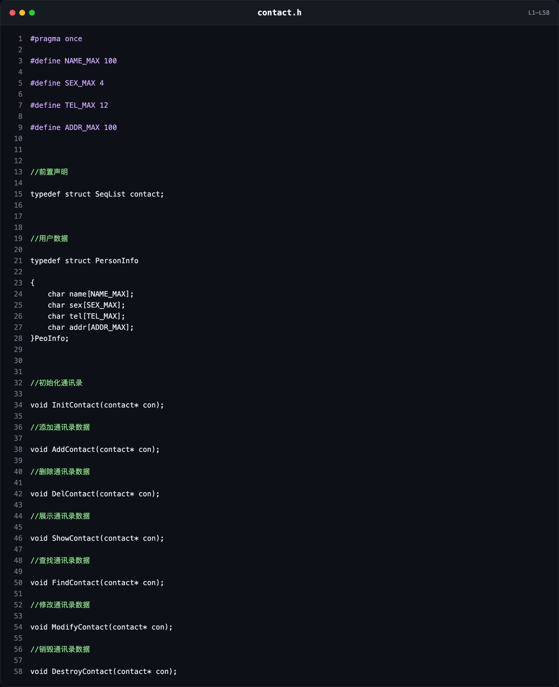
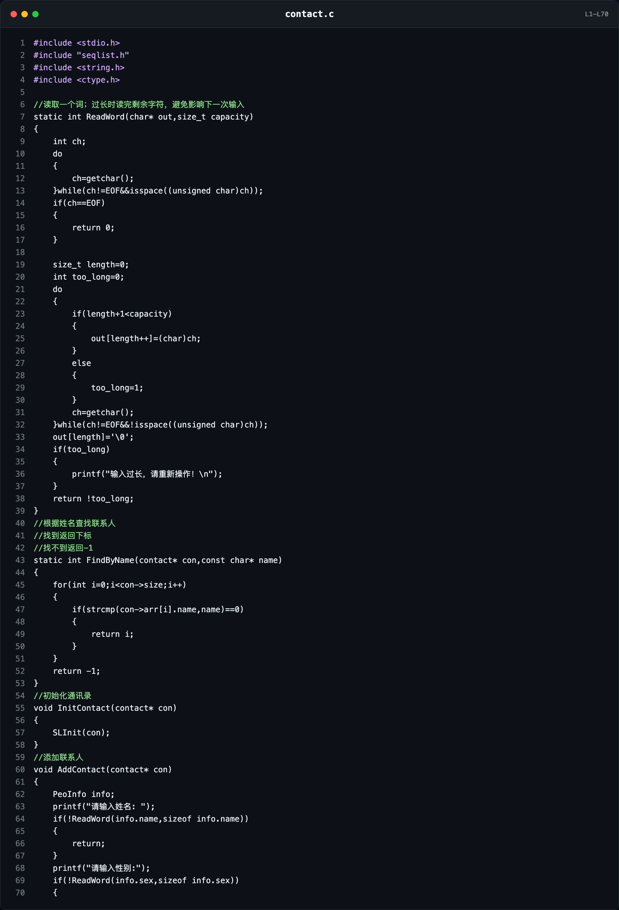
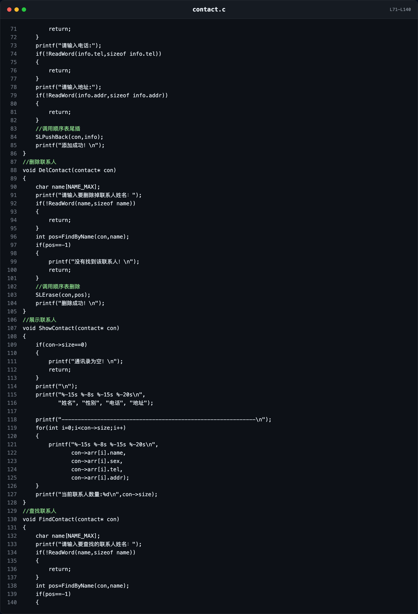
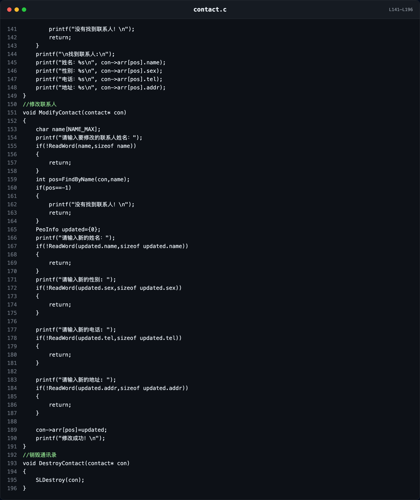
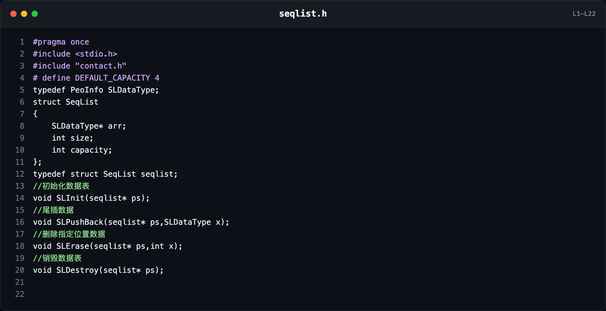
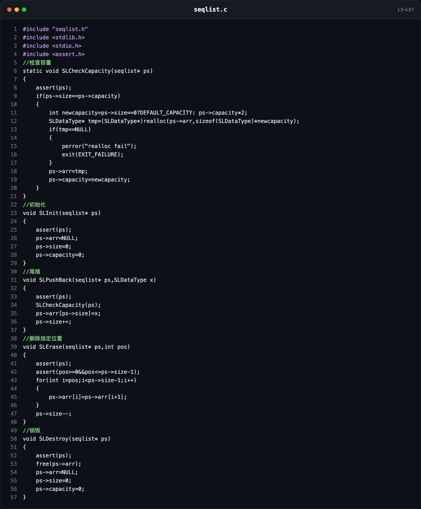
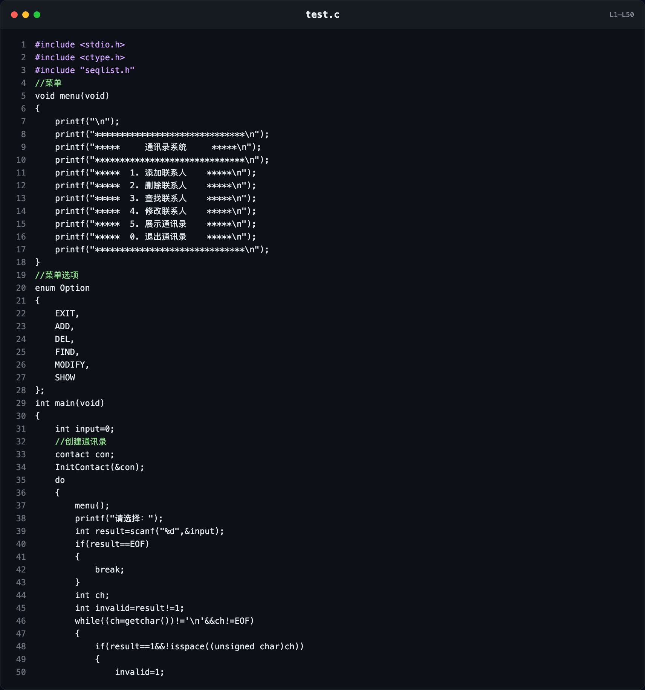
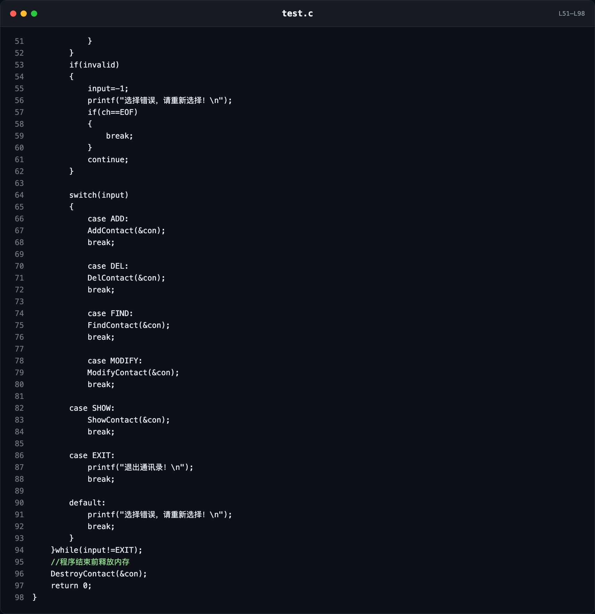

# C语言动态顺序表实现通讯录：从类型别名、指针到多文件编译

> 学习日期：2026 年 9 月 16 日。本文面向刚学完结构体、指针和动态内存的 C 语言初学者，记录我用动态顺序表实现通讯录时真正卡住的问题。正文先讲错误和理解过程，最后保留五个文件的完整代码、完整代码图片以及考前速记。

这次练习不是简单地把联系人放进数组。我真正容易混淆的是：`size` 和 `capacity` 各管什么，`typedef` 到底有没有创建新结构体，为什么前置声明以后仍然不能写 `con->size`，以及函数调用时到底该传 `con` 还是 `&con`。

下面所有解释都围绕这次通讯录项目展开，不堆脱离代码的概念。

---

## 一、先看项目由哪五个文件组成

这个通讯录已经是一个多文件程序：通讯录负责业务，顺序表负责底层存储，`test.c` 负责菜单和程序入口。

| 文件 | 主要职责 |
| --- | --- |
| `contact.h` | 定义联系人类型、前置声明通讯录类型、声明通讯录接口 |
| `contact.c` | 实现添加、删除、查找、修改、展示等通讯录业务 |
| `seqlist.h` | 定义动态顺序表结构，声明顺序表接口 |
| `seqlist.c` | 实现初始化、扩容、尾插、删除和销毁 |
| `test.c` | 提供 `main`、菜单、`enum` 和 `switch` |

调用关系可以先记成：

```text
test.c
  │ 调用 AddContact、DelContact……
  ▼
contact.c
  │ 调用 SLPushBack、SLErase……
  ▼
seqlist.c
```

再换一种说法：

```text
菜单层        test.c
业务层        contact.c
数据结构层    seqlist.c
```

这样分文件的好处是：以后把菜单改漂亮，不需要改顺序表；以后给顺序表增加功能，也不必重写菜单。

---

## 二、动态顺序表基础：`size` 和 `capacity` 不是一回事

顺序表的核心结构是：

```c
struct SeqList
{
    SLDataType* arr;
    int size;
    int capacity;
};
```

三个成员分别表示：

- `arr`：指向动态申请的联系人数组。
- `size`：当前有多少个**有效联系人**。
- `capacity`：当前申请的空间最多能装多少个联系人。

例如：

```text
size = 3，capacity = 4

下标：       0           1           2           3
          ┌────────┬────────┬────────┬────────┐
arr  ───> │ 张三   │ 李四   │ 王五   │ 未使用 │
          └────────┴────────┴────────┴────────┘
            有效       有效       有效      无效
          └──────── size = 3 ────────┘
          └────────── capacity = 4 ───────────┘
```

这里虽然一共有 4 个位置，但通讯录中只有 3 个联系人。程序只能把下标 `0` 到 `size - 1` 当作有效数据。

### 我当时为什么容易理解错

我容易把“申请了多少空间”和“已经存了多少数据”当成同一个数。实际上：

```text
capacity 管空间
size     管有效数据
```

### 错误写法 → 为什么错 → 正确理解 → 以后怎么判断

**错误理解：** `capacity = 4` 就表示已经有 4 个联系人。

**为什么错：** `capacity` 只表示空间上限，未使用的位置可能是旧数据，也可能是未初始化内容。

**正确理解：** 是否属于顺序表，只看下标是否满足 `0 <= 下标 < size`。

**以后怎么判断：** 遍历时永远写 `i < size`，不要写 `i < capacity`。

---

## 三、`DEFAULT_CAPACITY 4` 和 4、8、16、32 扩容

项目中写了：

```c
#define DEFAULT_CAPACITY 4
```

这里的 `4` 表示：顺序表第一次需要存数据时，先申请能放下 **4 个 `SLDataType` 元素**的空间。因为本项目中 `SLDataType` 是 `PeoInfo` 的别名，所以第一次申请的是 4 个联系人结构体的位置，不是 4 个字节。

初始化时并没有马上申请数组：

```text
初始化后：arr = NULL，size = 0，capacity = 0
第一次添加：申请 4 个 PeoInfo 的空间
```

扩容判断是：

```c
if (ps->size == ps->capacity)
```

当有效数据数量已经等于容量时，说明下一次插入前必须扩容：

```text
容量变化：0 → 4 → 8 → 16 → 32 → ……
```

对应代码：

```c
int newcapacity = ps->size == 0
                ? DEFAULT_CAPACITY
                : ps->capacity * 2;
```

第一次容量为 0，所以取 `DEFAULT_CAPACITY`，得到 4；之后每次乘 2。

### 为什么不每次只增加 1

如果每插入一个联系人就重新申请一次空间，程序会频繁搬家，效率很低。按 2 倍扩容可以减少 `realloc` 的调用次数，同时规则也容易理解。

---

## 四、`realloc` 做什么，为什么必须用 `tmp` 接收

扩容代码是：

```c
SLDataType* tmp = (SLDataType*)realloc(
    ps->arr,
    sizeof(SLDataType) * newcapacity
);
```

`realloc` 会调整原来那块动态内存的大小。它可能出现三种情况：

1. 原地扩大，返回的地址和原来相同。
2. 原地放不下，申请一块更大的新空间，把旧数据搬过去，再返回新地址。
3. 申请失败，返回 `NULL`，原来的内存仍然有效。

示意图：

```text
扩容前
ps->arr ───> [联系人0][联系人1][联系人2][联系人3]

可能原地扩大
ps->arr ───> [0][1][2][3][空][空][空][空]

也可能换地址
旧地址：      [0][1][2][3]             （随后由 realloc 处理）
新地址 tmp ─> [0][1][2][3][空][空][空][空]
```

### 错误写法

```c
ps->arr = realloc(ps->arr, sizeof(SLDataType) * newcapacity);
```

### 为什么错

如果 `realloc` 失败，它返回 `NULL`。直接赋给 `ps->arr` 会覆盖原来的地址，以后既找不到旧数据，也无法 `free` 原空间，造成内存泄漏。

### 正确写法

```c
SLDataType* tmp = (SLDataType*)realloc(
    ps->arr,
    sizeof(SLDataType) * newcapacity
);

if (tmp == NULL)
{
    perror("realloc fail");
    exit(EXIT_FAILURE);
}

ps->arr = tmp;
ps->capacity = newcapacity;
```

### 以后怎么判断

凡是一个函数“失败时可能返回 `NULL`，而原指针仍然重要”，就不要急着覆盖原指针。先用临时指针接收，检查成功后再赋值。

---

## 五、删除以后为什么还能看到旧数据

假设顺序表中有 4 个联系人：

```text
size = 4

下标：  0      1      2      3
      [张三] [李四] [王五] [赵六]
```

删除下标 1 的李四，需要把后面的数据依次向前覆盖：

```text
移动后、size-- 前：

下标：  0      1      2      3
      [张三] [王五] [赵六] [赵六]
```

最后执行：

```c
ps->size--;
```

此时：

```text
size = 3

有效范围：下标 0、1、2
下标 3 虽然还看得到旧的“赵六”，但它已经不属于顺序表。
```

### 错误理解 → 为什么错 → 正确理解 → 以后怎么判断

**错误理解：** 最后一个位置还有旧值，所以删除失败了。

**为什么错：** 顺序表的有效范围由 `size` 决定，不由内存里“看起来有没有值”决定。

**正确理解：** `size--` 后，下标 `size` 及其后面的空间都不再是有效元素。

**以后怎么判断：** 只遍历 `0` 到 `size - 1`。除非有安全或业务要求，否则删除时没有必要把尾部旧值专门清零。

---

## 六、`free` 后为什么还要重置三个成员

销毁代码是：

```c
free(ps->arr);
ps->arr = NULL;
ps->size = 0;
ps->capacity = 0;
```

`free(ps->arr)` 只是把动态内存还给系统，并不会自动修改结构体里的三个成员。

如果只 `free`，会出现：

```text
ps->arr      仍保存旧地址，但那个地址已经不能再使用 → 野指针
ps->size     仍像是有联系人
ps->capacity 仍像是有可用空间
```

重置后的状态才和“空顺序表”一致：

```text
arr = NULL
size = 0
capacity = 0
```

### 以后怎么判断

销毁一个动态容器时，要同时处理两件事：

1. 释放它拥有的动态内存。
2. 把描述这块内存的状态恢复为空。

---

## 七、结构体与 `typedef`：它只起别名，不创建对象

### 1. 完整结构体定义

```c
struct SeqList
{
    SLDataType* arr;
    int size;
    int capacity;
};
```

它告诉编译器：`struct SeqList` 里面依次有一个指针和两个整数。只有看到这个完整定义后，编译器才知道成员名称、成员类型和结构体大小。

### 2. 三种别名分别是什么意思

```c
typedef struct SeqList SeqList;
```

给 `struct SeqList` 起别名 `SeqList`。以后可以写：

```c
SeqList s;
```

```c
typedef struct SeqList contact;
```

给同一个 `struct SeqList` 起别名 `contact`。在通讯录业务中写 `contact con;` 更能表达“这是一个通讯录”。

```c
typedef struct SeqList seqlist;
```

还是给同一个 `struct SeqList` 起别名，只是这个别名叫 `seqlist`，方便顺序表底层接口使用。

可以画成：

```text
                         ┌── SeqList
struct SeqList  ──别名───┼── contact
                         └── seqlist

三个名字指向同一种类型，不是三个不同结构体。
```

本项目实际使用了 `contact` 和 `seqlist` 两个别名。`SeqList` 这个别名写法用来帮助理解，但最终代码中没有再定义它。

### 3. `typedef` 不会做什么

`typedef`：

- 不会创建新的结构体类型内容。
- 不会创建变量。
- 不会申请内存。
- 只是在给已有类型起一个更方便的名字。

### 错误理解 → 为什么错 → 正确理解 → 以后怎么判断

**错误理解：** `typedef struct SeqList contact;` 创建了一个叫 `contact` 的通讯录对象。

**为什么错：** 这一行没有变量名，只是在定义类型别名。

**正确理解：** 真正创建变量的是 `contact con;`。

**以后怎么判断：** 看到 `typedef`，先把它读成“把前面的类型以后也叫作后面的名字”。

---

## 八、`typedef PeoInfo SLDataType;` 为什么能让顺序表存联系人

`contact.h` 中先定义联系人：

```c
typedef struct PersonInfo
{
    char name[NAME_MAX];
    char sex[SEX_MAX];
    char tel[TEL_MAX];
    char addr[ADDR_MAX];
} PeoInfo;
```

`seqlist.h` 中再写：

```c
typedef PeoInfo SLDataType;
```

所以：

```text
SLDataType             本质上就是 PeoInfo
SLDataType*            本质上就是 PeoInfo*
SLDataType* arr        本质上就是 PeoInfo* arr
```

因此 `arr` 指向的不是一个联系人，而是一整组连续存放的联系人结构体：

```text
arr
 │
 ▼
┌──────────────┬──────────────┬──────────────┬──────────────┐
│ PeoInfo [0]  │ PeoInfo [1]  │ PeoInfo [2]  │ PeoInfo [3]  │
│ 姓名/性别/…  │ 姓名/性别/…  │ 姓名/性别/…  │ 姓名/性别/…  │
└──────────────┴──────────────┴──────────────┴──────────────┘
```

访问 `con->arr[i].name` 可以分三步理解：

```text
con->arr     找到联系人数组
[i]          找到第 i 个 PeoInfo
.name        访问这个联系人的姓名成员
```

电话数组写成：

```c
#define TEL_MAX 12
```

因为 11 位手机号作为 C 字符串存储时，还需要最后一个 `\0`：

```text
11 个数字 + 1 个字符串结束标志 '\0' = 至少 12 个 char
```

---

## 九、前置声明与“不完整类型”

`contact.h` 中有：

```c
typedef struct SeqList contact;
```

这一行既起了别名，也可以让编译器先知道：存在一个名叫 `struct SeqList` 的结构体类型。此时它还不知道结构体内部有什么，所以这叫**不完整类型**。

在只见过前置声明时，可以声明指针：

```c
contact* con;
```

因为指针本身的大小是确定的。但是还不能访问成员：

```c
con->size;
con->capacity;
con->arr;
```

编译器必须先看到完整定义：

```c
struct SeqList
{
    SLDataType* arr;
    int size;
    int capacity;
};
```

才知道 `size`、`capacity`、`arr` 在哪里。

### 我实际犯过的大小写错误

我曾经混用：

```c
struct SeqList
struct Seqlist
struct seqList
struct seqlist
```

C 语言严格区分大小写，这四个名称代表四种完全不同的结构体标签。

### 错误写法

```c
typedef struct SeqList contact;

struct Seqlist
{
    SLDataType* arr;
    int size;
    int capacity;
};
```

### 为什么错

前置声明说的是 `struct SeqList`，完整定义写的却是 `struct Seqlist`。编译器仍然只知道 `struct SeqList` “存在”，却始终看不到它的内部成员，所以访问 `con->size` 时会报不完整类型错误。

### 正确写法

```c
typedef struct SeqList contact;

struct SeqList
{
    SLDataType* arr;
    int size;
    int capacity;
};
```

### 以后怎么判断

遇到“不完整类型”时，按这个顺序检查：

1. 有没有完整的结构体定义。
2. 使用成员的 `.c` 文件是否包含了能看到完整定义的头文件。
3. 前置声明和完整定义的结构体标签是否逐字一致，尤其检查大小写。

【此处插入图片：VSCode中“不允许使用指向不完整类型 struct SeqList”的报错截图】

*图片说明：截取 VSCode 中 `con->size` 或 `con->arr` 下方红线，以及“指向不完整类型 `struct SeqList`”的完整报错信息，最好让前置声明和大小写不一致的结构体名同时出现在画面中。*

---

## 十、`static`：当前 `.c` 文件内部的辅助函数

顺序表扩容检查写成：

```c
static void SLCheckCapacity(seqlist* ps)
```

这里的 `static` 修饰函数，表示这个函数只在当前 `seqlist.c` 内部使用。可以把它理解为当前源文件的“私有辅助函数”。

这样做很合适，因为：

- 外部模块不需要主动检查容量。
- `SLPushBack` 在插入前自动调用它。
- 不把内部实现细节暴露到 `seqlist.h`。

`contact.c` 中的 `ReadWord`、`FindByName` 也使用了同样的做法。

### 函数内部的 `static` 局部变量

它和 `static` 函数不是同一个作用：

```c
void Test(void)
{
    int a = 0;          // 每次进入函数都会重新创建和初始化
    static int b = 0;   // 只初始化一次，下一次调用仍保留上次的值
}
```

初学阶段先记住：

```text
static 修饰函数       → 函数只供当前 .c 文件使用
static 修饰局部变量   → 生命周期持续到程序结束，值会保留
```

---

## 十一、头文件和源文件怎样配合

常见规则是：

```text
.h 文件：放类型、宏、函数声明
.c 文件：放函数的具体实现
```

本项目中的依赖关系是：

```text
contact.h
  ├─ 定义 PeoInfo
  ├─ 前置声明 struct SeqList
  └─ 声明通讯录接口

seqlist.h
  ├─ #include "contact.h"
  ├─ typedef PeoInfo SLDataType
  ├─ 完整定义 struct SeqList
  └─ 声明顺序表接口

contact.c
  ├─ 使用通讯录接口和 PeoInfo
  └─ 调用顺序表接口
```

### 为什么自己的 `.c` 最好直接包含自己的 `.h`

规范写法建议：

```c
#include "contact.h"
#include "seqlist.h"
```

原因是 `contact.c` 实现的是 `contact.h` 中声明的函数，直接包含自己的头文件，可以让编译器及时检查声明与定义是否一致。

当前最终代码的 `contact.c` 直接包含了 `seqlist.h`，而 `seqlist.h` 又间接包含 `contact.h`，所以当前代码可以正常编译。但“间接包含”容易随着头文件关系变化而失效。以后写自己的项目，优先让每个 `.c` 直接包含自己的 `.h`，再包含它额外依赖的头文件。

> 这一点是代码组织建议。为了保留本次最终确认版本，文末代码没有擅自改动包含关系。

---

## 十二、重点：到底传 `&con` 还是传 `con`

### 1. `main` 中的 `con` 是普通结构体变量

```c
contact con;
```

此时 `con` 的类型是 `contact`，它不是指针。

函数定义需要的是指针：

```c
void AddContact(contact* con);
```

所以在 `main` 中调用时必须传地址：

```c
AddContact(&con);
```

`&con` 的意思是“取得变量 `con` 的地址”。

```text
main 中

con（普通结构体变量）
┌──────────────────────────┐
│ arr │ size │ capacity    │
└──────────────────────────┘
  ▲
  │ &con：取得它的地址
  │
传给 AddContact(contact* con)
```

### 2. 进入函数后，形参 `con` 已经是指针

```c
void DelContact(contact* con)
{
    int pos = FindByName(con, name);
    SLErase(con, pos);
}
```

函数内部这个 `con` 的类型已经是 `contact*`，所以继续传给同样需要指针的函数时，直接传 `con`。

### 错误写法

```c
SLErase(&con, pos);
```

### 为什么错

函数内部：

```text
con   的类型是 contact*
&con  的类型是 contact**
```

`SLErase` 需要 `seqlist*`，而 `contact` 和 `seqlist` 都是 `struct SeqList` 的别名，所以传 `contact*` 的 `con` 正合适；再加 `&` 就多了一层指针。

### 正确写法

```c
FindByName(con, name);
SLErase(con, pos);
```

### 用普通 `int` 再理解一次

```c
void Change(int* p)
{
    *p = 100;
}

int main(void)
{
    int a = 10;
    Change(&a);
    return 0;
}
```

对应关系：

| 普通整数案例 | 通讯录案例 |
| --- | --- |
| `int a;` | `contact con;` |
| `int* p` | `contact* con` |
| `Change(&a)` | `AddContact(&con)` |
| 函数内部的 `p` 已经是指针 | 函数内部的 `con` 已经是指针 |

### 以后怎么判断

不要凭感觉数 `&`，而要对照类型：

```text
实参是 contact，形参要 contact*   → 传 &con
实参已是 contact*，形参要 contact* → 直接传 con
```

---

## 十三、`enum`：给菜单整数起有意义的名字

菜单选项：

```c
enum Option
{
    EXIT,
    ADD,
    DEL,
    FIND,
    MODIFY,
    SHOW
};
```

没有手动赋值时，枚举成员默认从 0 开始依次加 1，所以它实际上等价于：

```c
enum Option
{
    EXIT = 0,
    ADD = 1,
    DEL = 2,
    FIND = 3,
    MODIFY = 4,
    SHOW = 5
};
```

`enum` 的核心意义是：给整数起有意义的名字。

```c
case ADD:
```

比下面更容易看懂：

```c
case 1:
```

以后即使忘了 1 对应什么操作，看到 `ADD` 也知道是添加联系人。

---

## 十四、实际语法错误复盘

这一章单独记录真实报错，因为考试和写代码时，最浪费时间的往往不是大知识点，而是一个引号、分号或冒号。

### 错误 1：把 `&input` 写进双引号

#### 错误写法

```c
scanf("%d,&input");
```

#### 为什么错

双引号中的内容全部是格式字符串。编译器看到 `%d`，知道 `scanf` 还应该收到一个 `int*` 地址，但调用中只有一个字符串参数，没有提供 `%d` 对应的数据地址。

常见报错：

```text
more '%' conversions than data arguments
```

#### 正确写法

```c
scanf("%d", &input);
```

#### 以后怎么判断

先把 `scanf` 分成两部分看：

```text
"%d"    告诉 scanf 按整数格式读取
&input   告诉 scanf 把结果存到哪里
```

【此处插入图片：more '%' conversions than data arguments 报错截图】

*图片说明：截取错误代码 `scanf("%d,&input");`、红色波浪线和完整的 `more '%' conversions than data arguments` 报错文字。*

### 错误 2：`scanf` 后忘记分号

#### 错误写法

```c
scanf("%d", &input)
```

#### 为什么错

C 语言普通语句通常要用分号结束。编译器继续读取下一行时，发现上一条语句还没有结束。

常见报错：

```text
expected ';' after expression
```

#### 正确写法

```c
scanf("%d", &input);
```

#### 以后怎么判断

看到 `expected ';'`，先检查报错位置的前一行结尾。红线所在行不一定是真正写错的行。

### 错误 3：函数调用后写了冒号

#### 错误写法

```c
FindContact(&con):
```

#### 为什么错

函数调用是一条语句，结尾应当是分号。冒号常用于 `case`、标签等语法，不能代替普通语句的分号。

#### 正确写法

```c
FindContact(&con);
```

#### 以后怎么判断

写完函数调用后检查结尾：

```text
函数调用();
case 常量:
```

【此处插入图片：expected ';' after expression 报错截图】

*图片说明：优先截取漏写分号或把 `FindContact(&con);` 写成冒号时的代码，并让 `expected ';' after expression` 报错完整可见。若两次报错都有截图，可以分别插入两张。*

### 编译器报错位置为什么有时“看起来不对”

编译器按顺序读取代码。前一行少了分号时，它常常要读到下一行才确定语法无法继续，因此红线可能标在下一行。

排错时不要只盯着红线，要一起检查：

1. 报错行。
2. 报错行的前一行。
3. 附近的引号、括号、分号和冒号是否配对。

---

## 十五、多文件编译：不能只编译 `test.c`

这个项目有三个源文件：

```text
test.c
contact.c
seqlist.c
```

`test.c` 中只有函数声明和调用，真正的实现分布在另外两个 `.c` 文件中。因此 Mac + VSCode 终端应当这样编译：

```bash
clang test.c contact.c seqlist.c -o contact
```

运行：

```bash
./contact
```

`-o contact` 的意思是：把最终生成的可执行文件命名为 `contact`。

更严格的复习检查可以使用：

```bash
clang -std=c11 -Wall -Wextra -Wpedantic -Werror \
  test.c contact.c seqlist.c -o contact
```

### 为什么“clang 生成活动文件”可能出问题

VSCode 的“生成活动文件”往往只编译当前打开的 `test.c`。编译器虽然能看到函数声明，却没有把 `contact.c`、`seqlist.c` 中的函数实现一起链接进来，于是会出现“符号未定义”一类链接错误。

### 错误做法 → 为什么错 → 正确做法 → 以后怎么判断

**错误做法：**

```bash
clang test.c -o contact
```

**为什么错：** 缺少 `AddContact`、`SLPushBack` 等函数的实现文件。

**正确做法：**

```bash
clang test.c contact.c seqlist.c -o contact
```

**以后怎么判断：** 项目中有几个需要参与程序的 `.c` 文件，编译命令通常就要把它们都列出来；头文件不需要单独放进编译命令。

---

## 十六、最终完整项目代码与代码图片

下面五份代码来自本次最终确认版本。代码块用于复制；图片用于博客阅读和以后快速复习。图片直接从同一份源码生成，较长文件按行号拆成多张，没有省略代码。

### 1. `contact.h`

<!-- CODE:contact.h -->
```c
#pragma once

#define NAME_MAX 100

#define SEX_MAX 4

#define TEL_MAX 12

#define ADDR_MAX 100


//前置声明

typedef struct SeqList contact;


//用户数据

typedef struct PersonInfo

{
    char name[NAME_MAX];
    char sex[SEX_MAX];
    char tel[TEL_MAX];
    char addr[ADDR_MAX];
}PeoInfo;


//初始化通讯录

void InitContact(contact* con);

//添加通讯录数据

void AddContact(contact* con);

//删除通讯录数据

void DelContact(contact* con);

//展示通讯录数据

void ShowContact(contact* con);

//查找通讯录数据

void FindContact(contact* con);

//修改通讯录数据

void ModifyContact(contact* con);

//销毁通讯录数据

void DestroyContact(contact* con);
```



*图：`contact.h`——定义联系人数据、通讯录接口以及 `SeqList` 前置声明。*

### 2. `contact.c`

<!-- CODE:contact.c -->
```c
#include <stdio.h>
#include "seqlist.h"
#include <string.h>
#include <ctype.h>

//读取一个词；过长时读完剩余字符，避免影响下一次输入
static int ReadWord(char* out,size_t capacity)
{
    int ch;
    do
    {
        ch=getchar();
    }while(ch!=EOF&&isspace((unsigned char)ch));
    if(ch==EOF)
    {
        return 0;
    }

    size_t length=0;
    int too_long=0;
    do
    {
        if(length+1<capacity)
        {
            out[length++]=(char)ch;
        }
        else
        {
            too_long=1;
        }
        ch=getchar();
    }while(ch!=EOF&&!isspace((unsigned char)ch));
    out[length]='\0';
    if(too_long)
    {
        printf("输入过长，请重新操作！\n");
    }
    return !too_long;
}
//根据姓名查找联系人
//找到返回下标
//找不到返回-1
static int FindByName(contact* con,const char* name)
{
    for(int i=0;i<con->size;i++)
    {
        if(strcmp(con->arr[i].name,name)==0)
        {
            return i;
        }
    }
    return -1;
}
//初始化通讯录
void InitContact(contact* con)
{
    SLInit(con);
}
//添加联系人
void AddContact(contact* con)
{
    PeoInfo info;
    printf("请输入姓名: ");
    if(!ReadWord(info.name,sizeof info.name))
    {
        return;
    }
    printf("请输入性别:");
    if(!ReadWord(info.sex,sizeof info.sex))
    {
        return;
    }
    printf("请输入电话:");
    if(!ReadWord(info.tel,sizeof info.tel))
    {
        return;
    }
    printf("请输入地址:");
    if(!ReadWord(info.addr,sizeof info.addr))
    {
        return;
    }
    //调用顺序表尾插
    SLPushBack(con,info);
    printf("添加成功！\n");
}
//删除联系人
void DelContact(contact* con)
{
    char name[NAME_MAX];
    printf("请输入要删除掉联系人姓名：");
    if(!ReadWord(name,sizeof name))
    {
        return;
    }
    int pos=FindByName(con,name);
    if(pos==-1)
    {
        printf("没有找到该联系人！\n");
        return;
    }
    //调用顺序表删除
    SLErase(con,pos);
    printf("删除成功！\n");
}
//展示联系人
void ShowContact(contact* con)
{
    if(con->size==0)
    {
        printf("通讯录为空！\n");
        return;
    }
    printf("\n");
    printf("%-15s %-8s %-15s %-20s\n",
           "姓名", "性别", "电话", "地址");

    printf("------------------------------------------------------------\n");
    for(int i=0;i<con->size;i++)
    {
        printf("%-15s %-8s %-15s %-20s\n",
               con->arr[i].name,
               con->arr[i].sex,
               con->arr[i].tel,
               con->arr[i].addr);
    }
    printf("当前联系人数量:%d\n",con->size);
}
//查找联系人
void FindContact(contact* con)
{
    char name[NAME_MAX];
    printf("请输入要查找的联系人姓名：");
    if(!ReadWord(name,sizeof name))
    {
        return;
    }
    int pos=FindByName(con,name);
    if(pos==-1)
    {
        printf("没有找到联系人！\n");
        return;
    }
    printf("\n找到联系人:\n");
    printf("姓名：%s\n", con->arr[pos].name);
    printf("性别：%s\n", con->arr[pos].sex);
    printf("电话：%s\n", con->arr[pos].tel);
    printf("地址：%s\n", con->arr[pos].addr);
}
//修改联系人
void ModifyContact(contact* con)
{
    char name[NAME_MAX];
    printf("请输入要修改的联系人姓名：");
    if(!ReadWord(name,sizeof name))
    {
        return;
    }
    int pos=FindByName(con,name);
    if(pos==-1)
    {
        printf("没有找到联系人！\n");
        return;
    }
    PeoInfo updated={0};
    printf("请输入新的姓名：");
    if(!ReadWord(updated.name,sizeof updated.name))
    {
        return;
    }
    printf("请输入新的性别: ");
    if(!ReadWord(updated.sex,sizeof updated.sex))
    {
        return;
    }

    printf("请输入新的电话: ");
    if(!ReadWord(updated.tel,sizeof updated.tel))
    {
        return;
    }

    printf("请输入新的地址: ");
    if(!ReadWord(updated.addr,sizeof updated.addr))
    {
        return;
    }

    con->arr[pos]=updated;
    printf("修改成功！\n");
}
//销毁通讯录
void DestroyContact(contact* con)
{
    SLDestroy(con);
}
```



*图：`contact.c`（第 1—70 行）——安全读取输入、按姓名查找和添加联系人。*



*图：`contact.c`（第 71—140 行）——继续添加，并实现删除、展示和查找。*



*图：`contact.c`（第 141—196 行）——完成查找、修改和销毁。*

### 3. `seqlist.h`

<!-- CODE:seqlist.h -->
```c
#pragma once
#include <stdio.h>
#include "contact.h"
# define DEFAULT_CAPACITY 4
typedef PeoInfo SLDataType;
struct SeqList
{
    SLDataType* arr;   
    int size;
    int capacity;
};
typedef struct SeqList seqlist;
//初始化数据表
void SLInit(seqlist* ps);
//尾插数据
void SLPushBack(seqlist* ps,SLDataType x);
//删除指定位置数据
void SLErase(seqlist* ps,int x);
//销毁数据表
void SLDestroy(seqlist* ps);


```



*图：`seqlist.h`——定义元素类型、顺序表结构、默认容量和底层接口。*

### 4. `seqlist.c`

<!-- CODE:seqlist.c -->
```c
#include "seqlist.h"
#include <stdlib.h>
#include <stdio.h>
#include <assert.h>
//检查容量
static void SLCheckCapacity(seqlist* ps)
{
    assert(ps);
    if(ps->size==ps->capacity)
    {
        int newcapacity=ps->size==0?DEFAULT_CAPACITY: ps->capacity*2;
        SLDataType* tmp=(SLDataType*)realloc(ps->arr,sizeof(SLDataType)*newcapacity);
        if(tmp==NULL)
        {
            perror("realloc fail");
            exit(EXIT_FAILURE);
        }
        ps->arr=tmp;
        ps->capacity=newcapacity;
    }
}
//初始化
void SLInit(seqlist* ps)
{
    assert(ps);
    ps->arr=NULL;
    ps->size=0;
    ps->capacity=0;
}
//尾插
void SLPushBack(seqlist* ps,SLDataType x)
{
    assert(ps);
    SLCheckCapacity(ps);
    ps->arr[ps->size]=x;
    ps->size++;
}
//删除指定位置
void SLErase(seqlist* ps,int pos)
{
    assert(ps);
    assert(pos>=0&&pos<=ps->size-1);
    for(int i=pos;i<ps->size-1;i++)
    {
        ps->arr[i]=ps->arr[i+1];
    }
    ps->size--;
}
//销毁
void SLDestroy(seqlist* ps)
{
    assert(ps);
    free(ps->arr);
    ps->arr=NULL;
    ps->size=0;
    ps->capacity=0;
}
```



*图：`seqlist.c`——实现容量检查、初始化、尾插、删除和销毁。*

### 5. `test.c`

<!-- CODE:test.c -->
```c
#include <stdio.h>
#include <ctype.h>
#include "seqlist.h"
//菜单
void menu(void)
{
    printf("\n");
    printf("******************************\n");
    printf("*****     通讯录系统     *****\n");
    printf("******************************\n");
    printf("*****  1. 添加联系人    *****\n");
    printf("*****  2. 删除联系人    *****\n");
    printf("*****  3. 查找联系人    *****\n");
    printf("*****  4. 修改联系人    *****\n");
    printf("*****  5. 展示通讯录    *****\n");
    printf("*****  0. 退出通讯录    *****\n");
    printf("******************************\n");
}
//菜单选项
enum Option
{
    EXIT,
    ADD,
    DEL,
    FIND,
    MODIFY,
    SHOW
};
int main(void)
{
    int input=0;
    //创建通讯录
    contact con;
    InitContact(&con);
    do
    {
        menu();
        printf("请选择：");
        int result=scanf("%d",&input);
        if(result==EOF)
        {
            break;
        }
        int ch;
        int invalid=result!=1;
        while((ch=getchar())!='\n'&&ch!=EOF)
        {
            if(result==1&&!isspace((unsigned char)ch))
            {
                invalid=1;
            }
        }
        if(invalid)
        {
            input=-1;
            printf("选择错误，请重新选择！\n");
            if(ch==EOF)
            {
                break;
            }
            continue;
        }
        
        switch(input)
        {
            case ADD:
            AddContact(&con);
            break;
            
            case DEL:
            DelContact(&con);
            break;

            case FIND:
            FindContact(&con);
            break;

            case MODIFY:
            ModifyContact(&con);
            break;

        case SHOW:
            ShowContact(&con);
            break;

        case EXIT:
            printf("退出通讯录！\n");
            break;

        default:
            printf("选择错误，请重新选择！\n");
            break;
        }
    }while(input!=EXIT);
    //程序结束前释放内存
    DestroyContact(&con);
    return 0;
}
```



*图：`test.c`（第 1—50 行）——菜单、枚举、通讯录初始化和菜单输入检查。*



*图：`test.c`（第 51—98 行）——`switch` 分发各项操作，并在退出前销毁通讯录。*

---

## 十七、运行时可以怎样检查

编译：

```bash
clang -std=c11 -Wall -Wextra -Wpedantic -Werror \
  test.c contact.c seqlist.c -o contact
```

运行：

```bash
./contact
```

建议至少手动检查以下流程：

```text
1. 添加两个联系人
2. 展示通讯录
3. 按姓名查找
4. 修改联系人
5. 删除联系人
6. 再次展示
7. 输入错误菜单字符，确认程序可以继续
8. 退出程序
```

【此处插入图片：终端中添加、展示、查找、修改、删除联系人后正常退出的运行截图】

*图片说明：截取一次完整操作流程，至少让菜单、添加成功、查找结果、删除成功和退出提示清晰可见。*

---

## 考前速记

```text
1. size = 当前有效元素数量
2. capacity = 已申请空间最多能装多少元素
3. 有效下标范围 = 0 到 size - 1
4. DEFAULT_CAPACITY 4 = 首次申请 4 个元素的位置，不是 4 字节
5. 满了以后按 2 倍扩容：4、8、16、32……
6. realloc 用 tmp 接收，成功后再赋给原指针
7. 删除后尾部旧值可能还在，但 size-- 后已经无效
8. free 后重置：arr = NULL，size = 0，capacity = 0

9. &变量 = 取地址
10. *指针 = 解引用，通过地址找到对象
11. main 中 con 是 contact → 调用传 &con
12. 函数内 con 已经是 contact* → 继续调用传 con
13. 对 contact* 再取地址会变成 contact**

14. typedef = 给类型起别名，不创建变量，不申请内存
15. struct SeqList 和 SeqList 不一定天然相同，必须经过 typedef
16. typedef PeoInfo SLDataType 后，SLDataType* 就是 PeoInfo*
17. C 语言严格区分大小写
18. struct SeqList、struct Seqlist、struct seqList 完全不同
19. 前置声明只能说明“有这个类型”，不能访问内部成员
20. 看到完整 struct 定义以后，才能使用 ps->size、ps->arr

21. static 函数只在当前 .c 文件使用
22. enum 是给整数起有意义的名字
23. EXIT、ADD、DEL、FIND、MODIFY、SHOW 默认对应 0、1、2、3、4、5

24. 正确：scanf("%d", &input);
25. 不要把 &input 写进双引号
26. 普通语句结尾注意分号 ;
27. 函数调用结尾是 ;，不是 :
28. 报错位置不一定是真正错误位置，也要检查前一行

29. 多文件项目编译：
    clang test.c contact.c seqlist.c -o contact
30. VSCode“生成活动文件”可能只编译当前一个 .c 文件
```

最后把整套逻辑压缩成一句话：

> `contact` 和 `seqlist` 是同一个 `struct SeqList` 的不同别名；`arr` 指向一组 `PeoInfo`，`size` 决定有效数据，`capacity` 决定空间上限；主函数把 `&con` 交给业务函数，业务函数再把已经是指针的 `con` 交给顺序表函数。
