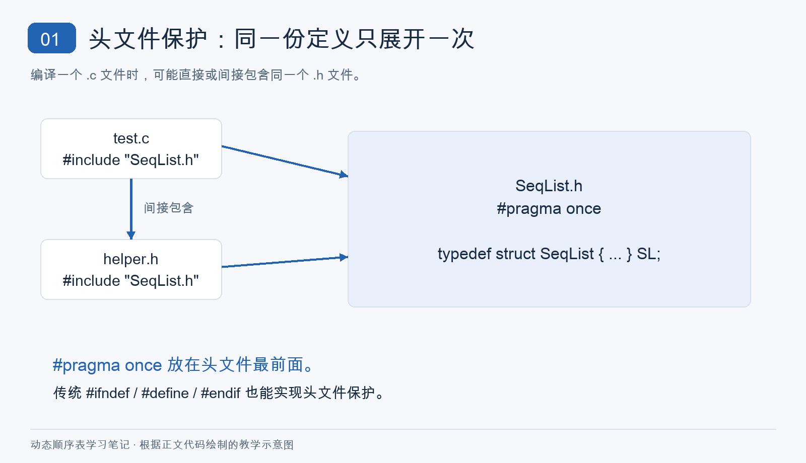
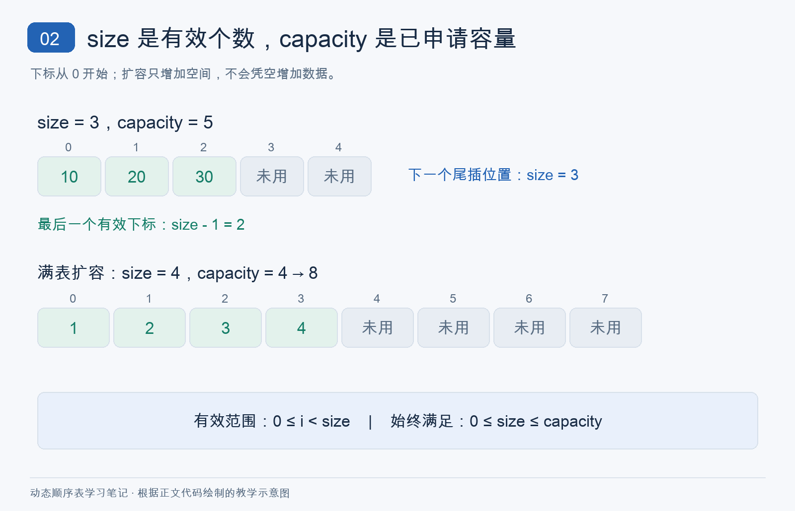
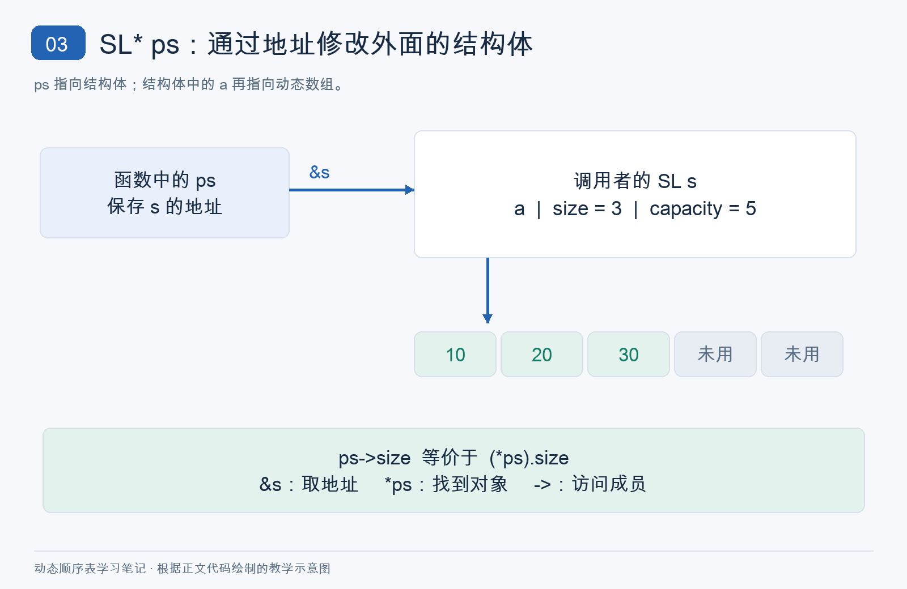
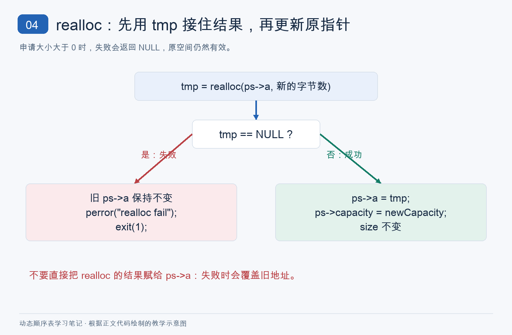
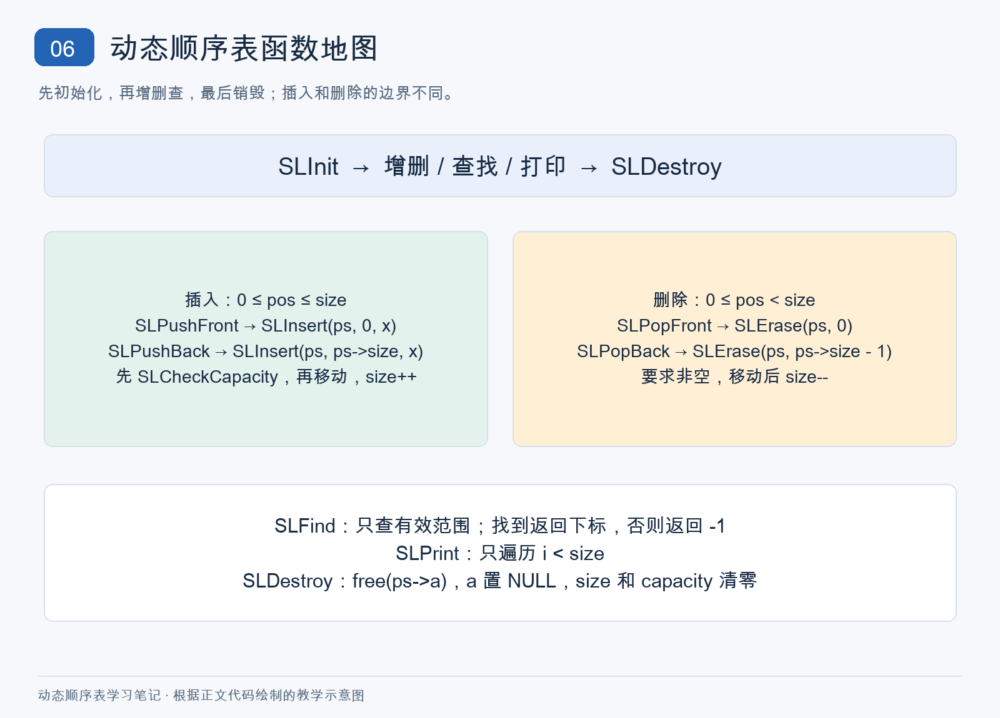

# C语言动态顺序表学习笔记：从 size、capacity 到指针、动态内存与增删操作

> 学习日期：2026 年 9 月 14 日。本文包含六张自制教学示意图；先按章节理解，复习时可直接看文末易错点和考前速记。

这篇笔记记录我学习动态顺序表时真正卡住的地方：`size` 和 `capacity` 到底管什么，`SL* ps` 为什么能修改外面的顺序表，申请的内存里有未初始化的值会不会影响使用，以及插入、删除时为什么要按特定方向搬动元素。先理解这些关系，再看完整代码；文末留了考前速记。

## 1. 先认识顺序表的三个成员

```c
typedef int SLDataType;

typedef struct SeqList
{
    SLDataType* a;
    int size;
    int capacity;
} SL;
```

`SLDataType` 暂时是 `int` 的别名。`a` 保存动态数组首元素的地址；`size` 记录当前**有效元素个数**；`capacity` 记录已经申请了多少个元素的位置。可以先记成：**顺序表 = 一块动态数组 + size + capacity**。结构体本身只存了指针和两个整数，数组空间需要另行申请。

## 2. 头文件最前面的 `#pragma once`

头文件开头常见的指令是：

```c
#pragma once
```

它用来防止同一个头文件在编译一个源文件时被重复包含，避免同一份结构体定义等内容出现多次。例如 `test.c` 已经包含 `SeqList.h`，它包含的另一个头文件也间接包含了 `SeqList.h`，就需要这种保护。它与下面的传统写法作用相近：

```c
#ifndef SEQLIST_H
#define SEQLIST_H

/* 头文件内容 */

#endif
```

`#pragma once` 很常见，但并非 C 标准规定的指令；这里的完整单文件示例不需要它。



*图 1：头文件重复包含与保护。根据正文代码绘制的教学示意图，并非课堂原始截图。*

## 3. size 和 capacity：已用与已申请

```text
size = 3，capacity = 5

下标：  0    1    2    3    4
      [10] [20] [30] [未用][未用]
       └── 有效数据 ──┘
```

数组有 5 个位置，但只有下标 `0` 到 `2` 是顺序表中的数据。未用位置可能存着旧值或未初始化的值，**不要读取它们**。始终有 `0 <= size <= capacity`。

> **重点：这三句话分别说的是“数量”“旧元素下标”“新元素位置”，不能混用。**

```text
有效元素个数             = size
最后一个有效元素下标     = size - 1（表非空时）
下一个尾插位置           = size（写入前先确保容量足够）
```

为什么数量是 3，最后一个下标却是 2？因为 C 数组从下标 0 开始，三个位置依次是 `0、1、2`。空表的 `size` 是 0，此时没有“最后一个有效元素”，不能访问 `a[-1]`。满表虽然下一个尾插位置仍是 `size`，但那个位置还没有空间，必须先扩容。

扩容前后可以这样看：

```text
扩容前：size = 4，capacity = 4
[1][2][3][4]

扩容后：size = 4，capacity = 8
[1][2][3][4][未用][未用][未用][未用]
```

扩容只增加可用空间，不会凭空产生四个新元素。因此扩容更新 `capacity`，不更新 `size`。



*图 2：size 与 capacity 的区别。根据正文代码绘制的教学示意图，并非课堂原始截图。*

## 4. `SL* ps`、`&`、`*`、`->` 怎么连起来

看到 `void SLInit(SL* ps);`，先把参数声明拆开：`SL` 是所指对象的类型，`*` 表明 `ps` 是指针变量，`ps` 是变量名。也就是说，`SL* ps` 声明了一个**指向 SL 对象的指针**；不要把声明里的 `*ps` 当作一个特殊的变量名。

```text
SL  → 类型
*   → 表示 ps 是指针变量
ps  → 变量名
```

写成 `SL* s` 时，`s` 也只是指针形参的名字，含义相同。本文统一把外面的顺序表对象叫 `s`，函数内指向它的指针叫 `ps`，避免名字来回切换。

```c
SL s;
SL* ps = &s;

/* &s：取得 s 的地址
   ps：保存这个地址
   *ps：通过地址找到 s
   ps->size：等价于 (*ps).size */
```

声明里的 `*` 表示“这是一个指针变量”；表达式里的 `*ps` 则是“沿着指针找到对象”。同一个符号出现在不同位置，作用不同。

真正初始化时这样调用，解决的是“把外面这个顺序表交给函数去修改”的问题：

```c
SL s;
SLInit(&s);
```

调用 `SLInit(&s)` 时，函数形参 `ps` 得到 `s` 的地址，可以把传参过程理解成 `ps = &s`，但这只是帮助理解的对应关系，不是在 `SLInit` 内再写这一行。下面是关系示意，地址数字只是示例：

```text
函数内的 ps                   调用者的 s（假设地址 0x1000）
[保存地址 0x1000] ──────────> [a | size | capacity]

ps->size = 0  修改的是地址 0x1000 处的 s.size
```

`void SLInit(SL ps)` 则会复制一份结构体，修改形参 `ps.size` 不会改变外面的 `s.size`。初始化需要修改原对象的三个成员，所以传 `SL*`。

| 传法 | 形参得到什么 | 在函数里改 size 的结果 |
| --- | --- | --- |
| `SL ps` | 结构体副本 | `ps.size = 0` 只修改副本 |
| `SL* ps` | 指向原结构体的地址值 | `ps->size = 0` 修改原结构体 |

C 的参数仍然是按值传递：第二种复制的是地址值，副本指针与原来的地址指向同一个对象。还有一个容易忽略的区别：结构体副本中的 `a` 也会复制旧地址，因此可能通过副本的 `a` 改到同一块数组；不能笼统地说“传结构体副本绝不影响任何外部数据”。这里传指针，关键是要修改原结构体成员本身。

`ps->size` 等价于 `(*ps).size`。后者先通过 `*ps` 找到结构体，再用 `.` 取成员；括号不能省，因为 `.` 的优先级高于一元 `*`。



*图 3：SL 指针、结构体与动态数组的关系。根据正文代码绘制的教学示意图，并非课堂原始截图。*

## 5. malloc、calloc、realloc、free 各负责什么

下面的短代码分别说明申请、调整和释放的作用；每次申请后，实际程序都应检查返回值是否为 `NULL`。

### 5.1 malloc：申请空间，不负责初始值

```c
int* p = (int*)malloc(5 * sizeof(int));
```

`malloc` 申请可存放 5 个 `int` 的空间，**不自动初始化**。这五个位置可想成 `[?][?][?][?][?]`；在赋值前不能把其中的值当数据读取。

`sizeof(int)` 是一个 `int` 占用的字节数，乘以 5 才是整块空间的字节数。顺序表的 `capacity` 以“元素个数”为单位，而内存申请函数接收的大小以“字节”为单位。

### 5.2 calloc：申请空间，并清零

```c
int* p = (int*)calloc(5, sizeof(int));
```

`calloc(元素个数, 每个元素大小)` 申请空间并将其字节清零。对这里的 `int` 数组，读到的是 `[0][0][0][0][0]`。

### 5.3 realloc：调整空间大小

```c
int* tmp = (int*)realloc(p, 10 * sizeof(int));
```

`realloc` 调整已申请空间的大小，可以扩大或缩小；原数据在新旧大小都容得下的范围内保留。返回地址可能和原地址不同，扩大的部分也**不保证清零**。必须先检查 `tmp`，成功后再令 `p = tmp`。本篇申请的大小均大于零，此时若 `realloc` 失败，原空间仍然有效。

```text
扩大： [1][2][3][4] → [1][2][3][4][?][?][?][?]
缩小： [1][2][3][4] → [1][2]
```

成功后必须以返回的地址为准，不要继续使用提前保存的旧数组地址；本文把结果赋回 `ps->a`，后面的操作统一通过它访问数组。

### 5.4 free：释放不再使用的空间

```c
free(p);
p = NULL;
```

`free` 释放动态申请的空间；忘记释放会造成内存泄漏。置 `NULL` 是为避免继续通过这个变量使用已释放地址。应传入动态分配返回的起始地址，不要释放普通局部数组，也不要释放 `p + 1` 这样的内部位置。`free(NULL)` 则是允许的，不执行任何释放操作。

这四个函数的声明来自 `<stdlib.h>`。示例保留课堂常见的 `(int*)` 或 `(SLDataType*)` 写法；在 C 中，`malloc` 返回的 `void*` 可以直接赋给对象指针，因此这种强制转换不是必需的，但头文件不能省略。

| 函数 | 用途 | 是否自动清零 |
| --- | --- | --- |
| `malloc` | 申请动态内存 | 否 |
| `calloc` | 申请动态内存 | 是 |
| `realloc` | 调整已有动态内存 | 新增区域不保证为 0 |
| `free` | 释放动态内存 | 不适用 |

## 6. 为什么顺序表初始化用 malloc，而不是 calloc

假设初始容量为 4，刚执行 `malloc` 后，四个位置尚未初始化：

```text
size = 0，capacity = 4
[未初始化][未初始化][未初始化][未初始化]
```

`size = 0` 意味着目前**没有任何有效元素**。尾插 10 时先写 `a[0] = 10`，再令 `size++`：

```text
size = 1，capacity = 4
[10][未用][未用][未用]
```

一个位置是否属于顺序表，由 `size` 决定，而不是由那个位置碰巧存着什么决定。后续插入会先写入再将其纳入有效范围，因此没有必要预先把所有位置清零。`calloc` 并非永远更好；只有确实需要初值为零时才选择它。

反过来，某个位置的值是 0，也不代表它“空着”。如果尾插的元素就是 0，那么写入并执行 `size++` 后，这个 0 同样是有效数据。**顺序表不用某个特殊数值标记空位。**

## 7. 初始化 SLInit：先有空间，再记录状态

以下代码负责给空顺序表申请初始空间；`INIT_CAPACITY` 在完整代码中定义为 4。

```c
void SLInit(SL* ps)
{
    assert(ps);

    ps->a = (SLDataType*)malloc(sizeof(SLDataType) * INIT_CAPACITY);
    if (ps->a == NULL)
    {
        perror("malloc fail");
        exit(1);
    }

    ps->size = 0;
    ps->capacity = INIT_CAPACITY;
}
```

逐句看它们各自解决的问题：

| 语句 | 作用 |
| --- | --- |
| `assert(ps)` | 要求传入的结构体指针不是 `NULL` |
| `malloc(sizeof(SLDataType) * INIT_CAPACITY)` | 申请能放 4 个元素的字节数 |
| `if (ps->a == NULL)` | 检查这次内存申请是否失败 |
| `perror(...)`、`exit(1)` | 失败时给出提示并停止程序，避免继续使用空地址 |
| `ps->size = 0` | 当前没有任何有效元素 |
| `ps->capacity = INIT_CAPACITY` | 记录已申请的元素容量 |

`assert(ps)` 和 `if (ps->a == NULL)` 检查的是两个不同层次：前者检查“顺序表对象的地址”，后者检查“数组空间的申请结果”。调用 `SLInit(&s)` 后，可以这样区分：

```text
ps ──> s 这个结构体
       ├─ a ──> [未用][未用][未用][未用]
       ├─ size = 0
       └─ capacity = 4
```

使用顺序是先 `SLInit`，再增删查，最后 `SLDestroy`。不要对仍然持有数组空间的表再次直接初始化，否则会覆盖 `a` 中的旧地址；要重新开始，应先销毁。

## 8. 什么时候需要扩容

插入前如果 `size == capacity`，所有位置已被有效元素占用。辅助函数 `SLCheckCapacity` 就是检查并在需要时扩容。初始容量 4 扩成 8 后，原来 4 个元素仍然是 4 个。

例如准备往 `[1][2][3][4]` 尾插 5：现在 `size = capacity = 4`，直接写 `a[4]` 会越界。先将容量扩大到 8，再写入 `a[4] = 5`，最后增加 `size`，这三个动作的顺序不能反过来。

```text
满表：       size = 4，capacity = 4
扩容成功：   size = 4，capacity = 8
插入成功：   size = 5，capacity = 8
```

如果 `size < capacity`，说明还有位置，辅助函数直接结束，既不搬动数据，也不修改计数。下面用两倍扩容演示“先确保空间”的逻辑：

```c
void SLCheckCapacity(SL* ps)
{
    assert(ps);

    if (ps->size == ps->capacity)
    {
        int newCapacity = ps->capacity * 2;
        SLDataType* tmp = (SLDataType*)realloc(
            ps->a, sizeof(SLDataType) * newCapacity
        );

        if (tmp == NULL)
        {
            perror("realloc fail");
            exit(1);
        }

        ps->a = tmp;
        ps->capacity = newCapacity;
    }
}
```

## 9. 为什么 realloc 要使用临时指针 tmp

这里的 `tmp` 是中间接收变量。下面这行是需要避免的写法，用来说明地址是怎样丢失的：

```c
/* 不推荐：失败时会覆盖 ps->a 中的旧地址。 */
ps->a = realloc(ps->a, sizeof(SLDataType) * newCapacity);
```

失败时返回的 `NULL` 会覆盖旧地址，旧空间虽然仍在，却可能再也找不到。先交给 `tmp`、确认成功后再更新 `ps->a`，才能保留失败时的旧地址。检查成功之前也不能提前更新 `capacity`，否则记录的容量会与实际空间不一致。

```text
旧 ps->a ──realloc──> tmp
                        │
              NULL：报错并结束
              非 NULL：ps->a = tmp，再更新 capacity
```

本例的 `exit(1)` 会立即结束整个程序；如果将来要让程序在扩容失败后继续运行，还需要设计返回错误值，并保留或清理原空间。现在先掌握“结果交给临时指针，检查成功后再替换旧地址”的顺序。



*图 4：realloc 临时指针与失败处理。根据正文代码绘制的教学示意图，并非课堂原始截图。*

## 10. perror 和 exit(1)：提示错误并终止程序

这段代码解决内存申请失败后“怎样报告、是否还能继续”的问题：

```c
if (tmp == NULL)
{
    perror("realloc fail");
    exit(1);
}
```

`perror("realloc fail")` 输出自定义提示和当前错误码对应的说明，可能类似：

```text
realloc fail: Cannot allocate memory
```

具体错误文字会因环境不同而变化。`perror` 自身只负责输出，不会终止程序，后面的 `exit(1)` 才让程序因错误结束。`exit(0)` 表示正常结束；这里使用 `exit(1)` 表示失败。不要把它与普通函数中的 `return;` 混淆：`return;` 只返回调用处，`exit` 会结束整个程序。

## 11. assert 到底是什么

`#include <assert.h>` 后可写 `assert(条件);`，意思是：我认为正常情况下条件必须成立，否则说明调用或程序逻辑有问题。条件不成立时，启用断言的程序会输出诊断信息并终止。

### 11.1 assert(ps)：检查是否为空指针

```c
assert(ps);  /* 相当于要求 ps != NULL */
```

这句是函数使用 `ps->size`、`ps->a` 之前的前提检查。**非空不等于一定有效**：如果指针没有初始化或指向已经失效的对象，断言并不能替我们识别所有问题。本文通过 `SL s; SLInit(&s);` 传入真实对象的地址。

### 11.2 删除前为什么检查 size > 0

```c
assert(ps->size > 0);
```

它要求表中至少有一个有效元素。`size = 0` 时没有元素可删；如果继续执行 `size--`，计数会变成 -1，后续操作的边界就全部错了。

### 11.3 插入为什么可以等于 size

```c
assert(pos >= 0 && pos <= ps->size);
```

当 `size = 3` 时，三个元素之间及两端一共有四个插入位置：

```text
插入位置： 0     1     2     3
           ↓     ↓     ↓     ↓
             [10]  [20]  [30]
元素下标：     0     1     2
```

位置 0 是头插，位置 3 是尾插，因此允许 `pos == size`。空表 `size = 0` 时也有唯一的插入位置 0。

### 11.4 删除为什么不能等于 size

```c
assert(pos >= 0 && pos < ps->size);
```

删除必须指定已经存在的元素。上面的真实下标只有 `0、1、2`，没有下标 3 的有效元素，因此要用 `< size`；空表没有任何合法删除位置。

> **易错点：插入允许 `0 <= pos <= size`，因为 `pos == size` 是尾插；删除只允许 `0 <= pos < size`，因为下标 `size` 上还没有有效元素。**

`assert` 适合检查这里的调用前提。若编译时定义了 `NDEBUG`，断言会被禁用；它不能代替 `malloc`、`realloc` 的失败检查，也不适合作为面向外部输入的唯一验证手段。

## 12. 头插 SLPushFront：一步一步腾出 a[0]

头插 5，原来是 `[10][20][30]`，`size = 3`。先确保容量足够，然后把最后一个有效元素 `a[2]` 搬到新位置 `a[3]`，接着搬 `a[1]`、`a[0]`：

```text
下标：             0    1    2    3
原来：           [10] [20] [30] [空]
a[3] = a[2]：    [10] [20] [30] [30]
a[2] = a[1]：    [10] [20] [20] [30]
a[1] = a[0]：    [10] [10] [20] [30]
a[0] = 5：      [ 5] [10] [20] [30]
size++：         有效元素个数从 3 变为 4
```

`i` 从 `size` 开始，因为 `size` 正好是下一个可写位置，而最后一个旧元素在 `size - 1`。

```c
void SLPushFront(SL* ps, SLDataType x)
{
    assert(ps);
    SLCheckCapacity(ps);

    for (int i = ps->size; i > 0; i--)
    {
        ps->a[i] = ps->a[i - 1];
    }

    ps->a[0] = x;
    ps->size++;
}
```

`SLCheckCapacity` 防止写越界；循环腾出 `a[0]`；最后写入新值并增加有效元素个数。

把循环中的 `i` 当成“这一次要写入的目标下标”，就更容易看清它的边界：

| i | 这一轮执行 | 含义 |
| --- | --- | --- |
| 3 | `ps->a[3] = ps->a[2]` | 将最后一个旧元素 30 放到新位置 |
| 2 | `ps->a[2] = ps->a[1]` | 将 20 后移 |
| 1 | `ps->a[1] = ps->a[0]` | 将 10 后移 |
| 0 | `i > 0` 不成立，退出循环 | 不访问 `a[-1]`，接下来单独写入新元素 |

如果从 `size - 1` 开始，第一次只会做 `a[2] = a[1]`，原来的 30 没有被保存到 `a[3]` 就遭到覆盖了。因此不是“遇到数组就从 `size - 1` 开始”，而是看循环变量代表源位置还是目标位置。

空表时 `size = 0`，循环一轮都不执行，直接写 `a[0] = x`，再将 `size` 改成 1，同一份代码也能完成第一次插入。


*图 5：头插时从后往前搬动的五个步骤。根据正文代码绘制的教学示意图，并非课堂原始截图。*

## 13. 为什么头插不能从前往后搬

下面故意写一个错误循环，用它定位“原数据从哪一步开始丢失”：

```c
/* 错误示例：不要用这个循环实现头插。 */
for (int i = 0; i < ps->size; i++)
{
    ps->a[i + 1] = ps->a[i];
}
```

如果从前往后执行 `a[i + 1] = a[i]`，第一步 `a[1] = a[0]` 就把原来的 20 覆盖掉了，下一步读到的 `a[1]` 已经是 10。

```text
原来：           [10][20][30][空]
a[1] = a[0]：    [10][10][30][空]  原来的 20 丢失
a[2] = a[1]：    [10][10][10][空]  原来的 30 也丢失
a[3] = a[2]：    [10][10][10][10]
```

即使最后再写 `a[0] = 5`，也只能得到错误的 `[5][10][10][10]`，无法恢复已经覆盖的 20 和 30。

> **易错点：搬动数据时不能提前覆盖尚未处理的数据。插入向后腾位置，所以从后往前搬；删除向前填空位，所以从前往后覆盖。**

## 14. 尾插 SLPushBack：写 a[size]，再增加 size

尾插不需要搬动，`a[size]` 恰好是新元素的位置：

```c
void SLPushBack(SL* ps, SLDataType x)
{
    assert(ps);
    SLCheckCapacity(ps);
    ps->a[ps->size] = x;
    ps->size++;
}
```

例如有效数据是 `[10][20][30]`，`size = 3`，下一个位置是 `a[3]`。先写 `a[3] = 40`，再把 `size` 改成 4。若先 `size++` 再写 `a[size]`，实际会写到 `a[4]`，中间漏掉 `a[3]`，满表边界时还可能越界。

## 15. 指定位置插入 SLInsert：把头插和尾插统一起来

指定位置插入把 `pos` 及其后面的旧元素向后移，允许 `pos == size`（此时循环不执行，即尾插）。

```c
void SLInsert(SL* ps, int pos, SLDataType x)
{
    assert(ps);
    assert(pos >= 0 && pos <= ps->size);
    SLCheckCapacity(ps);

    for (int i = ps->size; i > pos; i--)
    {
        ps->a[i] = ps->a[i - 1];
    }

    ps->a[pos] = x;
    ps->size++;
}
```

例如在 `[10][20][30]` 的下标 1 处插入 15，只搬动 20 和 30，不动前面的 10：

```text
原来：         [10][20][30][空]
a[3] = a[2]：  [10][20][30][30]
a[2] = a[1]：  [10][20][20][30]
a[1] = 15：    [10][15][20][30]
size++：       3 → 4
```

循环条件 `i > pos` 保证最后一次搬动是 `a[pos + 1] = a[pos]`，刚好腾出 `a[pos]`。从逻辑上看，头插就是 `SLInsert(ps, 0, x)`，尾插就是 `SLInsert(ps, ps->size, x)`。单独写头插和尾插函数是为了把操作名称和搬动过程看清楚；它们遵循同一套位置规则。

## 16. 尾删 SLPopBack：为什么不必把末尾清零

尾删只需让 `size--`，不必把原末尾位置改成零：该位置已退出有效范围。前提是表不为空。

```c
void SLPopBack(SL* ps)
{
    assert(ps);
    assert(ps->size > 0);
    ps->size--;
}
```

```text
删除前：size = 3，capacity = 4
[10][20][30][未用]

删除后：size = 2，capacity = 4
[10][20][旧值30][未用]
 └有效─┘  此位置已经不属于顺序表中的数据
```

删除改变的是逻辑上的有效范围，并不会释放一个元素大小的动态空间，所以 `capacity` 保持不变。下一次尾插会覆盖 `a[2]`。即使把原末尾改成 0 却忘记 `size--`，打印仍然会把这个 0 当成有效元素：清零不能替代删除。

## 17. 头删 SLPopFront：从前往后覆盖

头删 `[10][20][30][40]` 时，依次令 `a[0] = a[1]`、`a[1] = a[2]`、`a[2] = a[3]`，得到有效序列 `[20][30][40]`。每一步都先读取右边尚未覆盖的元素，因此可以从前往后：

```c
void SLPopFront(SL* ps)
{
    assert(ps);
    assert(ps->size > 0);

    for (int i = 0; i < ps->size - 1; i++)
    {
        ps->a[i] = ps->a[i + 1];
    }

    ps->size--;
}
```

```text
原来：          [10][20][30][40]
a[0] = a[1]：   [20][20][30][40]
a[1] = a[2]：   [20][30][30][40]
a[2] = a[3]：   [20][30][40][40]
size--：        前三个元素有效，末尾旧值不再属于顺序表
```

为什么循环是 `i < size - 1`？因为右侧要读 `a[i + 1]`，最大只能读到最后一个有效元素 `a[size - 1]`，所以目标下标 `i` 最大是 `size - 2`。如果表中只有一个元素，循环不执行，`size--` 后自然变成空表。

## 18. 指定位置删除 SLErase

指定位置删除从 `pos` 起向前覆盖。`pos` 必须是真实存在的元素下标，故不允许等于 `size`。

```c
void SLErase(SL* ps, int pos)
{
    assert(ps);
    assert(pos >= 0 && pos < ps->size);

    for (int i = pos; i < ps->size - 1; i++)
    {
        ps->a[i] = ps->a[i + 1];
    }

    ps->size--;
}
```

头删相当于 `SLErase(ps, 0)`，尾删相当于 `SLErase(ps, ps->size - 1)`，但都要先保证表非空。插入和删除的共同思路是：先找到合法位置，再搬动必要元素，最后更新 `size`。

```text
SLInsert(ps, 0, x)          → 头插
SLInsert(ps, ps->size, x)   → 尾插

SLErase(ps, 0)             → 头删（要求非空）
SLErase(ps, ps->size - 1)   → 尾删（要求非空）
```

删最后一个元素时 `pos = size - 1`，循环条件一开始就不成立，只执行 `size--`；这与尾删的代码一致。不用分别死记四套互不相关的逻辑。

## 19. 查找 SLFind：只找有效元素

查找和打印都只处理下标 `0` 到 `size - 1`。如果遍历到 `capacity - 1`，会把未用位置也当成数据，甚至读取未初始化的内容。

```c
int SLFind(SL* ps, SLDataType x)
{
    assert(ps);

    for (int i = 0; i < ps->size; i++)
    {
        if (ps->a[i] == x)
        {
            return i;
        }
    }

    return -1;
}
```

找到返回下标；`-1` 不可能是合法下标，因此用来表示未找到。这里的 `return i` 会立刻结束整个 `SLFind` 函数，回到调用处，不再继续循环。因此存在重复值时，返回的是第一个匹配元素的下标。

只有循环全部找完且没有命中，程序才会执行循环后面的 `return -1`。空表的循环不执行，也直接返回 -1。不能拿返回值 -1 直接去访问 `a[-1]`。

## 20. 打印 SLPrint：不要遍历 capacity

打印也只循环到 `size`，每轮打印一个有效元素，循环结束后换行：

```c
void SLPrint(SL* ps)
{
    assert(ps);

    for (int i = 0; i < ps->size; i++)
    {
        printf("%d ", ps->a[i]);
    }
    printf("\n");
}
```

本篇 `SLDataType` 是 `int`，所以使用 `%d`；以后如果换了元素类型，打印格式也要相应修改。空表只输出一个换行，不会尝试读取数组。`capacity` 代表空间容量，其中可能有未初始化值或删除留下的旧值，都不应该打印。

## 21. 销毁 SLDestroy：释放的是数组空间

用完后释放数组，并将三个成员复位：

```c
void SLDestroy(SL* ps)
{
    assert(ps);
    free(ps->a);
    ps->a = NULL;
    ps->size = 0;
    ps->capacity = 0;
}
```

`free(ps->a)` 释放的是动态数组，外面的局部结构体 `s` 本身还在。`free` 不会自动修改 `ps->a`，所以需要显式赋 `NULL`；再将 `size`、`capacity` 都归零，让状态明确。

若其他指针也曾保存数组地址，把 `ps->a` 置空不会自动把那些指针置空；它们也不能再使用。本篇统一通过 `ps->a` 访问数组。

销毁后的“零容量状态”和刚初始化的“有容量空表”不同：前者没有数组空间，后者有 4 个可用位置。本文扩容从已有正容量翻倍，因此销毁后不能直接插入，若要继续使用，须先重新 `SLInit`。

## 22. 一份可运行的完整动态顺序表代码

下面是单文件 `SeqList.c`。前面的小段代码用于理解各自解决的问题；这里把所有函数放在一起，并添加必要的头文件、初始容量定义和测试入口。扩容函数依赖初始容量大于零；本例固定为 4。



*图 6：动态顺序表函数与边界总览。根据正文代码绘制的教学示意图，并非课堂原始截图。*

```c
#include <stdio.h>
#include <stdlib.h>
#include <assert.h>

#define INIT_CAPACITY 4

typedef int SLDataType;

typedef struct SeqList
{
    SLDataType* a;
    int size;
    int capacity;
} SL;

void SLInit(SL* ps)
{
    assert(ps);
    ps->a = (SLDataType*)malloc(sizeof(SLDataType) * INIT_CAPACITY);
    if (ps->a == NULL)
    {
        perror("malloc fail");
        exit(1);
    }
    ps->size = 0;
    ps->capacity = INIT_CAPACITY;
}

void SLDestroy(SL* ps)
{
    assert(ps);
    free(ps->a);
    ps->a = NULL;
    ps->size = 0;
    ps->capacity = 0;
}

void SLPrint(SL* ps)
{
    assert(ps);
    for (int i = 0; i < ps->size; i++)
    {
        printf("%d ", ps->a[i]);
    }
    printf("\n");
}

void SLCheckCapacity(SL* ps)
{
    assert(ps);
    if (ps->size == ps->capacity)
    {
        int newCapacity = ps->capacity * 2;
        SLDataType* tmp = (SLDataType*)realloc(
            ps->a, sizeof(SLDataType) * newCapacity
        );
        if (tmp == NULL)
        {
            perror("realloc fail");
            exit(1);
        }
        ps->a = tmp;
        ps->capacity = newCapacity;
    }
}

void SLPushBack(SL* ps, SLDataType x)
{
    assert(ps);
    SLCheckCapacity(ps);
    ps->a[ps->size] = x;
    ps->size++;
}

void SLPopBack(SL* ps)
{
    assert(ps);
    assert(ps->size > 0);
    ps->size--;
}

void SLPushFront(SL* ps, SLDataType x)
{
    assert(ps);
    SLCheckCapacity(ps);
    for (int i = ps->size; i > 0; i--)
    {
        ps->a[i] = ps->a[i - 1];
    }
    ps->a[0] = x;
    ps->size++;
}

void SLPopFront(SL* ps)
{
    assert(ps);
    assert(ps->size > 0);
    for (int i = 0; i < ps->size - 1; i++)
    {
        ps->a[i] = ps->a[i + 1];
    }
    ps->size--;
}

void SLInsert(SL* ps, int pos, SLDataType x)
{
    assert(ps);
    assert(pos >= 0 && pos <= ps->size);
    SLCheckCapacity(ps);
    for (int i = ps->size; i > pos; i--)
    {
        ps->a[i] = ps->a[i - 1];
    }
    ps->a[pos] = x;
    ps->size++;
}

void SLErase(SL* ps, int pos)
{
    assert(ps);
    assert(pos >= 0 && pos < ps->size);
    for (int i = pos; i < ps->size - 1; i++)
    {
        ps->a[i] = ps->a[i + 1];
    }
    ps->size--;
}

int SLFind(SL* ps, SLDataType x)
{
    assert(ps);
    for (int i = 0; i < ps->size; i++)
    {
        if (ps->a[i] == x)
        {
            return i;
        }
    }
    return -1;
}

int main(void)
{
    SL s;
    SLInit(&s);

    SLPushBack(&s, 1);
    SLPushBack(&s, 2);
    SLPushBack(&s, 3);
    SLPrint(&s);

    SLPushFront(&s, 10);
    SLPrint(&s);

    SLInsert(&s, 2, 20);
    SLPrint(&s);

    SLErase(&s, 2);
    SLPrint(&s);

    SLPopFront(&s);
    SLPopBack(&s);
    SLPrint(&s);

    printf("find 2: %d\n", SLFind(&s, 2));
    SLDestroy(&s);
    return 0;
}
```

运行时各行依次应为：

```text
1 2 3
10 1 2 3
10 1 20 2 3
10 1 2 3
1 2
find 2: 1
```

前五行每个数字后会有一个空格，不影响结果。测试过程可以对着这张表检查，避免程序“能运行”却不知道每一步是否正确：

| 操作完成后 | 有效数据 | size | capacity |
| --- | --- | --- | --- |
| 初始化 | 空表 | 0 | 4 |
| 依次尾插 1、2、3 | `1 2 3` | 3 | 4 |
| 头插 10 | `10 1 2 3` | 4 | 4 |
| 在下标 2 插入 20 | `10 1 20 2 3` | 5 | 8 |
| 删除下标 2 的元素 | `10 1 2 3` | 4 | 8 |
| 头删一次，再尾删一次 | `1 2` | 2 | 8 |
| 查找 2 | 返回下标 1 | 2 | 8 |
| 销毁 | `a = NULL` | 0 | 0 |

这里特意在满表时执行指定位置插入，用来验证扩容后原数据仍被保留、搬动位置正确。查找返回 1，因为剩下的 2 在下标 1，并不是因为“第二个元素就返回 2”。

代码把头插、尾插、指定位置插入都单独实现，方便观察不同位置怎样搬动；删除也是同理。若要拆成 `SeqList.h`、`SeqList.c`、`test.c`，应把类型和函数声明放入头文件，把函数定义放入 `SeqList.c`，把 `main` 放入 `test.c`；两个 `.c` 文件都包含 `SeqList.h`，不要让 `main` 同时出现在两个源文件里。

## 23. Windows + VS Code 如何运行

先在 VS Code 终端检查编译器：

```bash
gcc --version
```

若将上面的完整代码保存为 `SeqList.c`，编译：

```bash
gcc SeqList.c -o SeqList.exe
```

在 PowerShell 终端运行：

```bash
.\SeqList.exe
```

若已经拆成三个文件，则编译和运行：

```bash
gcc SeqList.c test.c -o test.exe
.\test.exe
```

VS Code 主要负责编辑；真正把 C 源码编译成程序的是 GCC、Clang、MSVC 等编译器。本文命令以已安装 GCC 的 Windows 环境为前提，终端需要位于源码所在目录。如果提示找不到 `gcc`，应先检查编译器安装和 PATH 配置。

这份代码在循环中声明变量，使用支持 C99 及更新标准的 GCC 即可。也可以把单文件编译命令写成 `gcc -std=c11 -Wall -Wextra SeqList.c -o SeqList.exe`，明确采用 C11，并显示常用警告。

## 24. 本次学习中的易错点

这些是我这次学习中实际困惑过的地方，复习时先看这一节，再回看对应代码。

1. **混淆 `size` 和 `capacity`**：前者是有效元素个数，后者是已申请位置数；始终有 `size <= capacity`。
2. **把 `size` 当成最后一个下标**：非空表最后一个有效下标是 `size - 1`，下一个尾插位置才是 `size`。
3. **看不懂 `SL* ps`**：这是声明指向 `SL` 的指针变量 `ps`，并非一个叫 `*ps` 的特殊变量。
4. **混淆 `*`、`&`、`->`**：`&s` 取地址，`ps` 保存地址，`*ps` 取得对象，`ps->size` 等于 `(*ps).size`。
5. **担心 `malloc` 中的未初始化值影响顺序表**：`size = 0` 时没有有效数据；插入要先写值再增大 `size`，不能读取未用位置。
6. **认为 `calloc` 永远更好**：顺序表插入会覆盖新位置，没有要求整个数组预先为零，`malloc` 足够。
7. **让 `realloc` 直接覆盖原指针**：失败会返回 `NULL`，导致原地址丢失；先用 `tmp` 接收，成功后再更新 `ps->a`。
8. **头插时从前往后移动**：会覆盖尚未搬走的值。插入通常从后往前，删除通常从前往后；核心是别提前覆盖待处理数据。
9. **忘记修改 `size`**：插入后 `size++`，删除后 `size--`；单纯扩容只改 `capacity`。
10. **混淆插入和删除位置范围**：插入允许 `0 <= pos <= size`，删除要求 `0 <= pos < size`。
11. **按 `capacity` 遍历**：打印和查找只处理 `i < size` 的有效元素。

## 25. 考前速记：三分钟回顾

| 操作 | 核心逻辑 |
| --- | --- |
| 初始化 | `malloc`，`size = 0`，设置 `capacity` |
| 扩容 | `size == capacity` 时用临时指针接 `realloc` |
| 尾插 | `a[size] = x`，然后 `size++` |
| 尾删 | 非空前提下 `size--` |
| 头插 | 先扩容，从后往前移动 |
| 头删 | 非空前提下从前往后覆盖 |
| 指定位置插入 | `pos` 及其后的元素从后往前移动 |
| 指定位置删除 | `pos` 后面的元素向前覆盖 |
| 查找、打印 | 只遍历 `0` 到 `size - 1` |
| 插入合法范围 | `0 <= pos <= size` |
| 删除合法范围 | `0 <= pos < size` |
| 指针检查 | `assert(ps)`；内存申请失败还需检查 `NULL` |
| 销毁 | `free`，指针置 `NULL`，计数清零 |

## 26. 必背的 10 句话

1. `size` 是有效元素个数。
2. `capacity` 是当前申请的容量。
3. 非空表最后一个有效元素下标是 `size - 1`。
4. `a[size]` 是尾插新元素的位置，写入前要保证容量足够。
5. 扩容改变 `capacity`，不会凭空增加元素。
6. `SL* ps` 表示 `ps` 是指向顺序表的指针。
7. `ps->size` 等价于 `(*ps).size`。
8. 插入为避免覆盖未处理的数据，通常从后往前移动。
9. 删除通常让后面的元素向前覆盖。
10. 动态申请的内存最终需要 `free`。

**建议的 CSDN 标签：** C语言、数据结构、顺序表、指针、动态内存管理。
