# 数据结构复习：从顺序表到单链表——二级指针与链表经典题总结

> 这篇笔记把我最近的顺序表、单链表练习放在一起。作业保留截图里的思路，解释尽量短；我反复弄混的头指针、二级指针和 `free` 会多写几句。文中的“错误写法”是错题复盘，不代表旁边截图中仍是错误代码。

图中带“根据学习笔记重建”或“题意摘要”的，是我后来依据笔记制作的复习图，**不是当时的作业截图**。

## 一、顺序表和单链表先分清

一道链表选择题问链表的特点：A. 插入或删除时无需移动其他元素；B. 数据在内存中一定连续；C. 需要事先估计存储空间；D. 可以随机访问表内元素。选 **A**。链表节点不要求连续，插删通常改链接；普通单链表按位置查找要从头走，不能按下标直接跳过去。节点也可以按需申请。

我还问过：“顺序表可以随机访问某一个元素吗？”可以。顺序表的元素连续存放，目标地址可以由“首地址 + 下标 × 元素大小”算出，按下标访问是 `O(1)`。

| 对比 | 顺序表 | 单链表 |
| --- | --- | --- |
| 内存 | 元素连续 | 节点不要求连续 |
| 下标访问 | `O(1)` | `O(n)` |
| 插删 | 可能要移动元素 | 找到位置后通常改指针；找位置可能要 `O(n)` |
| 空间 | 动态顺序表常有 `size/capacity` | 节点通常按需申请 |

## 二、从 `malloc` 到头指针

### `malloc` 创建的是什么

我写过：

```c
SLTNode* node2 = (SLTNode*)malloc(sizeof(SLTNode));
```

`malloc` 返回 `void*`。在 **C 语言**里，`void*` 能自动转换成对象指针，所以强转不是必需的：

```c
SLTNode* node2 = malloc(sizeof *node2);
```

这里 `sizeof *node2` 取的是节点大小，不是指针大小。`malloc` 只申请内存；指针类型告诉编译器怎样解释那块内存。拿到内存后，还要初始化节点成员，并在适当时候 `free`。

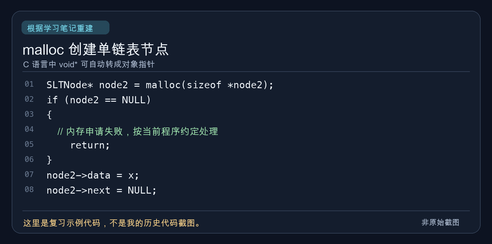

### `phead` 是节点吗

✅ 正确理解：`phead` 是**保存第一个节点地址的指针变量**，不是节点本身。下面没有额外的哨兵节点：

```text
phead ──> [ data | next ] ──> [ data | next ] ──> NULL

空链表：phead ──> NULL
```

所以 `phead == NULL` 表示一个节点都没有。`phead->next` 的意思是先按 `phead` 里的地址找到第一个节点，再读该节点的 `next`；它等价于 `(*phead).next`。只有 `phead` 非空时才能这样访问。

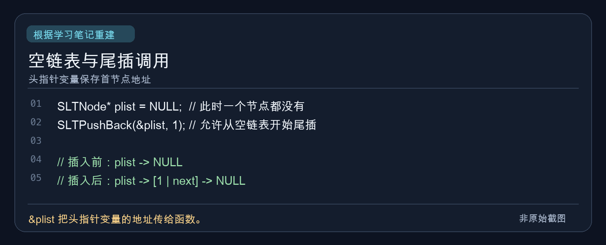

### `*`、`&` 和二级指针

设 `SLTNode* plist` 保存首节点地址 `0x100`，变量 `plist` 自己放在 `0x500`：

```text
地址 0x500：plist = 0x100
                    │
                    ▼
地址 0x100：[ 第一个 SLTNode 节点 ]
```

`plist` 是第一个节点的地址；`*plist` 是第一个节点本身；`&plist` 是指针变量 `plist` 自己的地址，也就是例子里的 `0x500`。记法很直接：`&` 取变量地址，`*` 根据地址找到它指向的对象；解引用前要保证地址有效。

再写 `SLTNode** pphead = &plist;`：

```text
pphead ──> plist ──> 第一个节点
  0x500      0x100
```

`pphead` 保存头指针变量 `plist` 的地址；`*pphead` 就是 `plist`，值为首节点地址；首节点存在时，`**pphead` 才是那个节点本身。口头说“第一个节点地址的地址”能帮助记忆，严谨说法是“保存头指针变量自己的地址”。

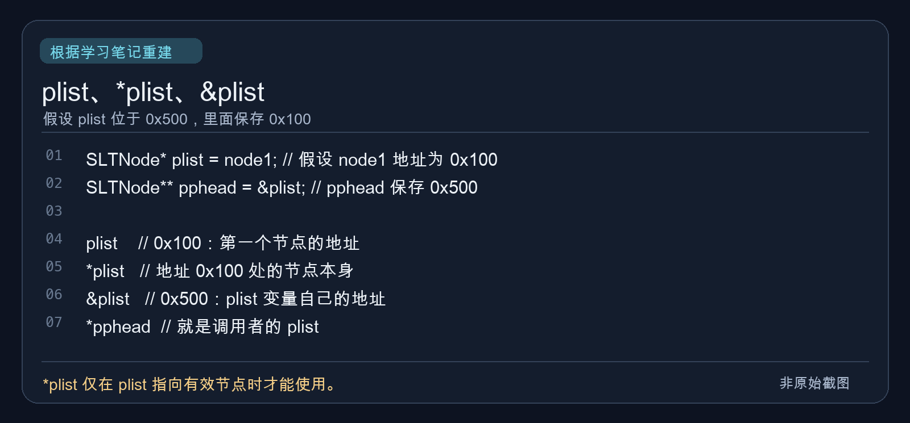

## 三、二级指针到底解决了什么

### 为什么 `phead = newnode` 改不了外面的 `plist`

```c
void func(SLTNode* phead)
{
    phead = newnode; // 示例：newnode 已指向一个新节点
}

SLTNode* plist = NULL;
func(plist);
```

C 的实参是**按值传递**。调用时，`phead` 只拿到 `plist` 里地址值的一份副本；给 `phead` 重新赋值，变的是这个局部变量。函数结束后，外面的 `plist` 仍为 `NULL`。

```text
调用前：plist = NULL，phead = NULL
赋值后：plist = NULL，phead = newnode
```

如果传 `&plist`，形参用 `SLTNode** pphead`，情况就不同：

```c
void func(SLTNode** pphead)
{
    *pphead = newnode; // 示例：newnode 已指向一个新节点
}

SLTNode* plist = NULL;
func(&plist);
```

此时 `*pphead` 正是调用者的 `plist`，所以 `*pphead = newnode` 真正改了外面的头指针。复习时把两句并排看：

| 写法 | 实际改了谁 |
| --- | --- |
| `phead = newnode;` | 函数内部的指针副本 |
| `*pphead = newnode;` | 调用者的指针变量 |

我以前说“修改指针本身的地址”，这个说法不准。若 `pos` 变量位于 `0x500`，原来保存 `0x100`，执行 `pos = newnode;` 且 `newnode` 保存 `0x300`，变化的是 **`pos` 中保存的地址值 `0x100 → 0x300`**；`pos` 变量本身仍在 `0x500`。

### `next` 也是指针，为什么 `SLTInsertAfter` 只传一级指针

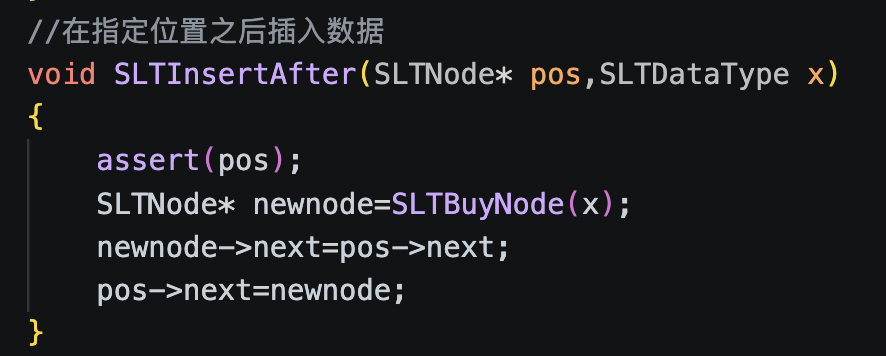

```c
void SLTInsertAfter(SLTNode* pos, SLTDataType x)
{
    assert(pos);
    SLTNode* newnode = SLTBuyNode(x);
    newnode->next = pos->next;
    pos->next = newnode;
}
```

❓ 我的疑问：`next` 本身也是指针，为什么不用二级指针？因为 `pos = newnode` 和 `pos->next = newnode` 改的是不同地方。前者改局部 `pos` 的值；后者等价于 `(*pos).next = newnode`，改的是 `pos` 所指**真实节点里的成员**。外面的指针也指向同一个节点，自然能看到链表变化。

先接 `newnode->next = pos->next`，再改 `pos->next`，原后继才不会丢。**函数里的指针是局部变量，不等于它指向的内存也是局部的。**

### 尾插、尾删的 `assert` 为什么不同

```c
// 尾插：允许空链表插入第一个节点
assert(pphead);

// 尾删：原链表必须至少有一个节点
assert(pphead && *pphead);
```

尾插允许 `*pphead == NULL`；尾删不允许。`&&` 从左往右短路求值：若 `pphead` 为 `NULL`，就不会继续计算 `*pphead`，避免空指针解引用。

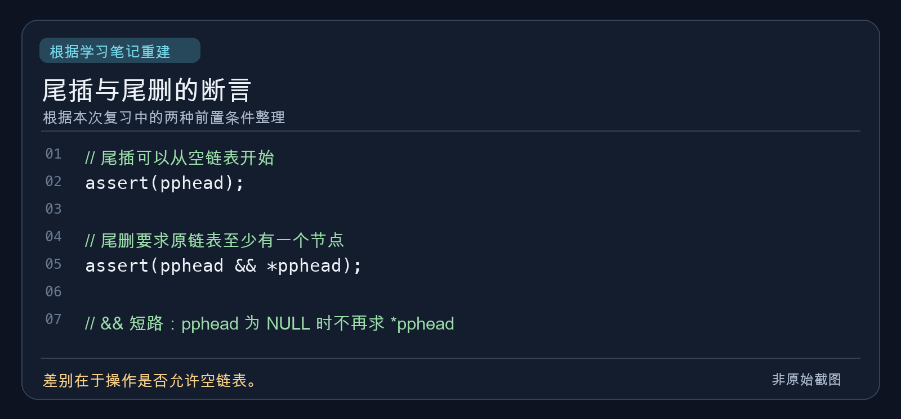

### 删除 `pos` 时，为什么 `pos` 不用二级指针

我练习过的逻辑是：

```c
void SLTErase(SLTNode** pphead, SLTNode* pos)
{
    assert(pphead && *pphead && pos);
    SLTNode* prev = *pphead;

    if (pos == *pphead)
    {
        SLTPopFront(pphead);
    }
    else
    {
        while (prev->next != pos)
        {
            prev = prev->next;
        }
        prev->next = pos->next;
        free(pos);
        pos = NULL;
    }
}
```

中间节点真正的“摘链”发生在 `prev->next = pos->next`，它修改前驱节点的成员；`free(pos)` 只需要待释放内存的地址，一级指针足够。这里的 `pos = NULL` 只清空函数内的副本，调用者若还保存该节点地址，那个指针仍会悬空。此写法还**要求 `pos` 确实属于该链表**；否则 `while` 走到末尾会解引用空指针。

头节点是另一回事：`plist → [10] → [20] → [30]` 头删后，要让外面的 `plist` 改指向 `[20]`。因此需要类似 `*pphead = (*pphead)->next;` 的赋值。需要二级指针的原因是**要修改调用者的头指针**，不是 `free` 要求二级指针。删除中间的 `[20]` 时，`prev->next = pos->next; free(pos);` 就够了，`plist` 仍指向 `[10]`。

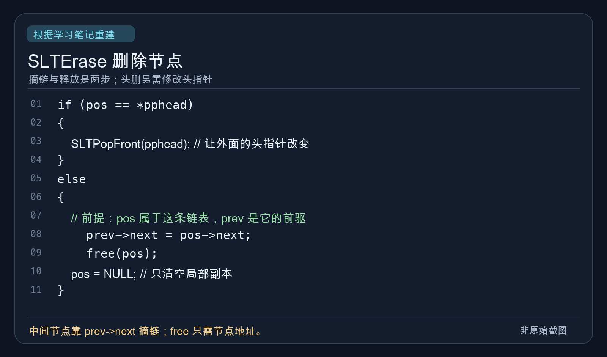

### `free(pos); pos = NULL;` 会清空外面的指针吗

不会。`free(pos)` 能释放那个地址对应的动态内存；`pos = NULL` 改的只是函数里的副本。调用者的指针仍保存旧地址，成为悬空指针。若函数的目标还包括清空调用者的指针，可以传它的地址：

```c
void releaseNode(SLTNode** pp)
{
    free(*pp);
    *pp = NULL;
}

// 调用：releaseNode(&p);
```

### 销毁整条链表能不能只传一级指针

可以释放所有节点，包括第一个节点：

```c
void SLTDestroy(SLTNode* phead)
{
    while (phead)
    {
        SLTNode* next = phead->next;
        free(phead);
        phead = next;
    }
}
```

但外面的 `plist` 没变成 `NULL`，而是悬空。不是“其他节点删了，头节点没删”，而是“所有节点都释放了，调用者的头指针没清空”。所以我更想用下面这一版：

```c
void SLTDestroy(SLTNode** pphead)
{
    SLTNode* cur = *pphead;
    while (cur)
    {
        SLTNode* next = cur->next;
        free(cur);
        cur = next;
    }
    *pphead = NULL;
}
```

这里约定 `pphead` 是有效地址。**头节点**是第一个真实的 `SLTNode`；**头指针**是 `SLTNode* plist` 这样的变量。头节点可以已被释放，而头指针仍保存旧地址，这就是悬空指针。

## 四、我的链表作业

### LeetCode 206：反转链表

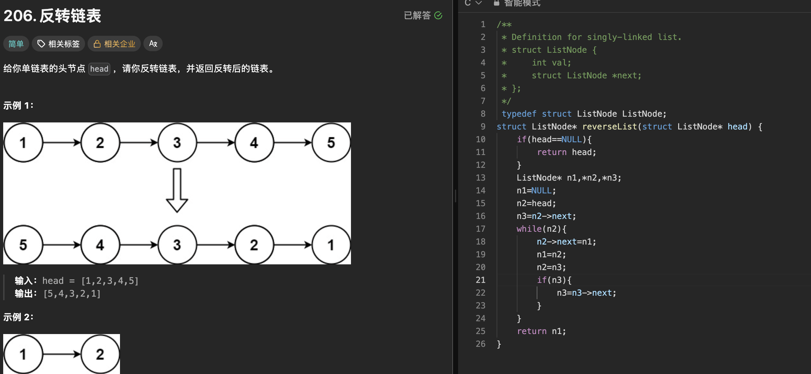

截图里我用三个指针，空链表先返回：

```c
struct ListNode* reverseList(struct ListNode* head)
{
    if (head == NULL)
    {
        return head;
    }
    ListNode* n1, *n2, *n3;
    n1 = NULL;
    n2 = head;
    n3 = n2->next;
    while (n2)
    {
        n2->next = n1;
        n1 = n2;
        n2 = n3;
        if (n3)
        {
            n3 = n3->next;
        }
    }
    return n1;
}
```

`n1` 是已反转部分的头，`n2` 是当前节点，`n3` 提前保存后继：

```text
已反转  <- n1     n2 -> n3 -> 后续
                  改 next 前先记住 n3
```

如果先改 `n2->next` 而没保存后继，剩余链表可能找不回来。时间 `O(n)`，额外空间 `O(1)`。

### LeetCode 203：移除链表元素

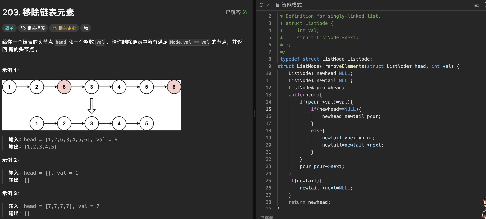

我把不等于 `val` 的原节点接成一条新链，最后把尾节点的 `next` 置空：

```c
struct ListNode* removeElements(struct ListNode* head, int val)
{
    ListNode* newhead = NULL;
    ListNode* newtail = NULL;
    ListNode* pcur = head;
    while (pcur)
    {
        if (pcur->val != val)
        {
            if (newhead == NULL)
            {
                newhead = newtail = pcur;
            }
            else
            {
                newtail->next = pcur;
                newtail = newtail->next;
            }
        }
        pcur = pcur->next;
    }
    if (newtail)
    {
        newtail->next = NULL;
    }
    return newhead;
}
```

⚠️ 改进点：如果链表节点由自己 `malloc` 并负责回收，被跳过的节点在这份代码里没有 `free`，会泄漏；`newtail->next = NULL` 只负责断开结果链，不负责释放它们。这里保留我的拼接思路。

### LeetCode 876：链表的中间结点

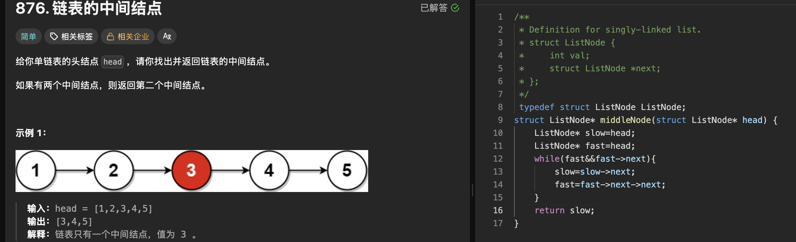

```c
struct ListNode* middleNode(struct ListNode* head)
{
    ListNode* slow = head;
    ListNode* fast = head;
    while (fast && fast->next)
    {
        slow = slow->next;
        fast = fast->next->next;
    }
    return slow;
}
```

`slow` 一次一步，`fast` 一次两步；偶数个节点时，`slow` 落在第二个中间节点。时间 `O(n)`，额外空间 `O(1)`。

### 环形链表：约瑟夫问题

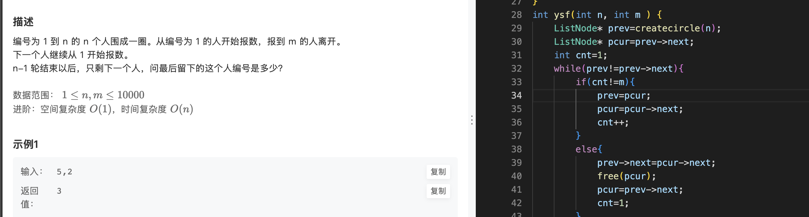

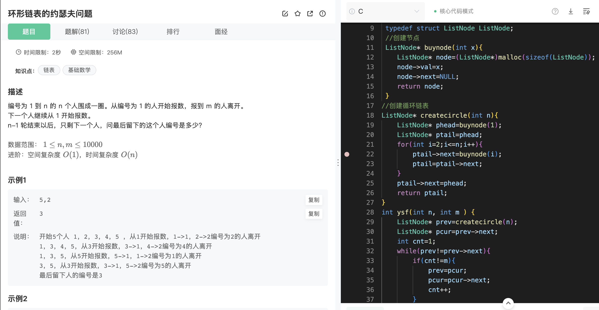

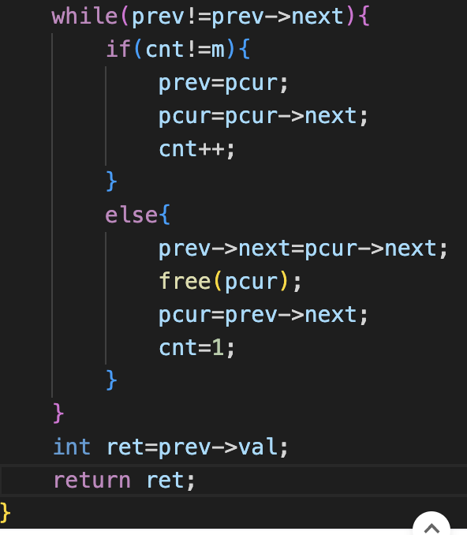

创建链表时，我让尾节点连回头节点，并返回尾节点：

```c
ListNode* buynode(int x)
{
    ListNode* node = (ListNode*)malloc(sizeof(ListNode));
    node->val = x;
    node->next = NULL;
    return node;
}

ListNode* createcircle(int n)
{
    ListNode* phead = buynode(1);
    ListNode* ptail = phead;
    for (int i = 2; i <= n; i++)
    {
        ptail->next = buynode(i);
        ptail = ptail->next;
    }
    ptail->next = phead;
    return ptail;
}
```

因此 `prev = createcircle(n)` 是尾节点，`pcur = prev->next` 是头节点。循环中一直保持 `prev->next == pcur`：

```c
int ysf(int n, int m)
{
    ListNode* prev = createcircle(n);
    ListNode* pcur = prev->next;
    int cnt = 1;
    while (prev != prev->next)
    {
        if (cnt != m)
        {
            prev = pcur;
            pcur = pcur->next;
            cnt++;
        }
        else
        {
            prev->next = pcur->next;
            free(pcur);
            pcur = prev->next;
            cnt = 1;
        }
    }
    int ret = prev->val;
    return ret;
}
```

❓ 我问过循环条件能否写 `pcur != pcur->next`。在**这份代码维持上述不变量**时可以：只剩一个节点时 `prev == pcur`，两个节点的 `next` 都指回自身。保留 `prev != prev->next` 更贴合“前驱看是否只剩自己”的写法。

⚠️ 截图代码取得最后编号后没有 `free(prev)`，自己管理节点内存时应记得释放最后一个节点。另外，截图题目的进阶要求是时间 `O(n)`、空间 `O(1)`；这份创建环形链表的写法需要 `O(n)` 节点空间，逐个报数的时间最坏是 `O(nm)`，**不满足进阶要求**。这里仍保留我实际写的链表解法。

### LeetCode 21：合并两个有序链表

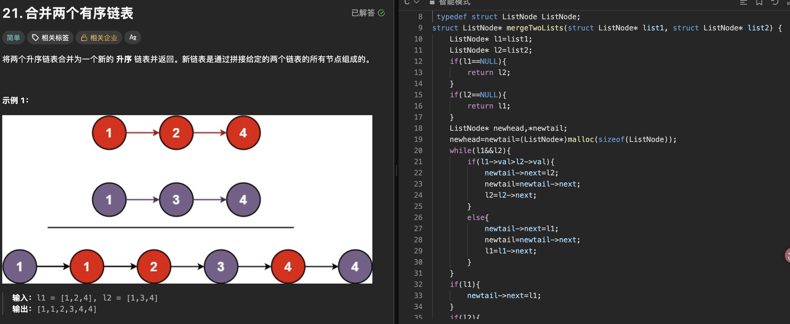

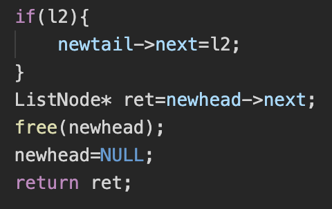

我用了额外的虚拟头节点 `newhead`，`newtail` 一直指向结果链表尾部：

```c
struct ListNode* mergeTwoLists(struct ListNode* list1, struct ListNode* list2)
{
    ListNode* l1 = list1;
    ListNode* l2 = list2;
    if (l1 == NULL) return l2;
    if (l2 == NULL) return l1;

    ListNode* newhead, *newtail;
    newhead = newtail = (ListNode*)malloc(sizeof(ListNode));
    while (l1 && l2)
    {
        if (l1->val > l2->val)
        {
            newtail->next = l2;
            newtail = newtail->next;
            l2 = l2->next;
        }
        else
        {
            newtail->next = l1;
            newtail = newtail->next;
            l1 = l1->next;
        }
    }
    if (l1) newtail->next = l1;
    if (l2) newtail->next = l2;

    ListNode* ret = newhead->next;
    free(newhead);
    newhead = NULL;
    return ret;
}
```

虚拟头节点省去“第一次接入”的特殊分支。真正结果的头是 `newhead->next`，所以先存进 `ret`，再释放额外申请的 dummy；后面接入的是原链表节点，不需要逐个新建。dummy 也能定义成栈变量，不一定要 `malloc`。这份练习代码默认申请成功；实际自己管理内存时还要检查 `malloc` 返回值。时间 `O(m+n)`，额外空间 `O(1)`。

## 五、数组题的两处语法错

### LeetCode 88：合并两个有序数组

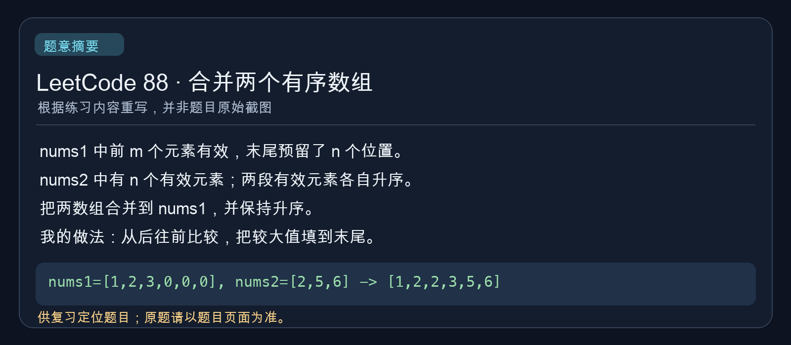

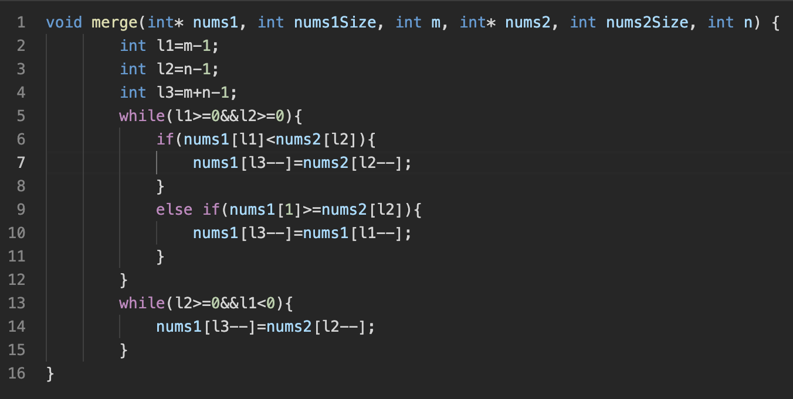

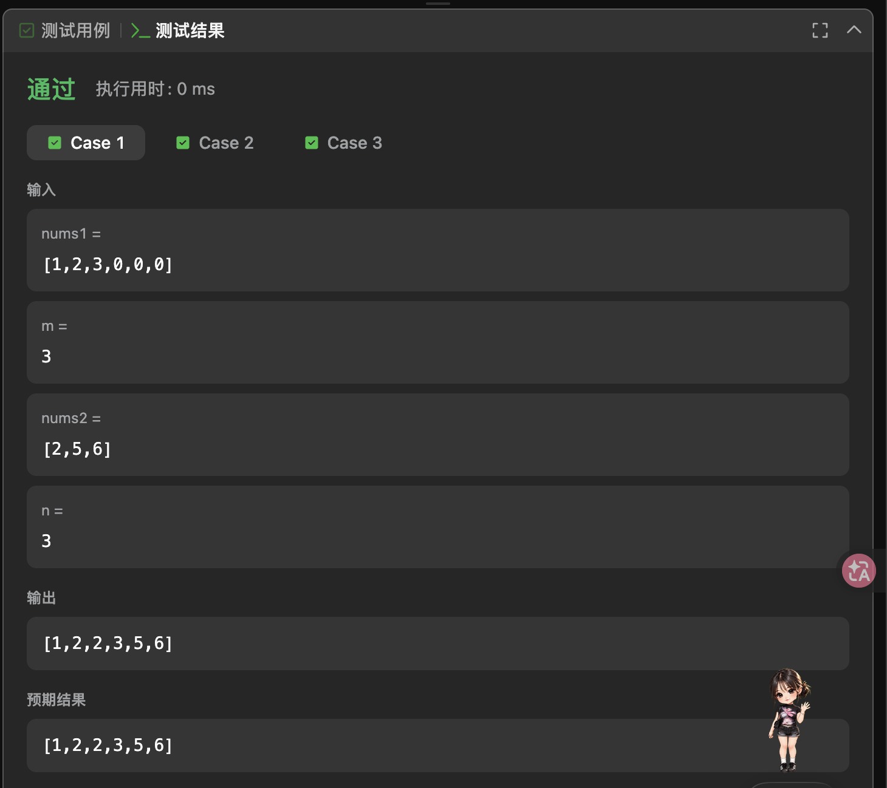

整体思路是从后往前比较：`l1 = m - 1`、`l2 = n - 1`、`l3 = m + n - 1`，较大元素填入 `nums1` 的末尾。我的**历史错误写法**是：

```c
// 错误写法：减的是 nums2[l2] 这个元素的值
nums1[l3--] = nums2[l2]--;

// 正确写法：用当前元素后，让下标 l2 减 1
nums1[l3--] = nums2[l2--];
```

截图里已经是正确的 `l2--`，不能把历史错误当成截图原码。`nums2[l2]--` 的 `--` 作用于数组元素；`nums2[l2--]` 的 `--` 作用于下标变量。以后看到后置 `--`，先看它紧跟着的是哪个表达式。

按这次复习整理的正确写法：

```c
void merge(int* nums1, int nums1Size, int m,
           int* nums2, int nums2Size, int n)
{
    int l1 = m - 1;
    int l2 = n - 1;
    int l3 = m + n - 1;
    while (l1 >= 0 && l2 >= 0)
    {
        if (nums1[l1] < nums2[l2])
            nums1[l3--] = nums2[l2--];
        else
            nums1[l3--] = nums1[l1--];
    }
    while (l2 >= 0)
        nums1[l3--] = nums2[l2--];
}
```

### LeetCode 27：移除元素

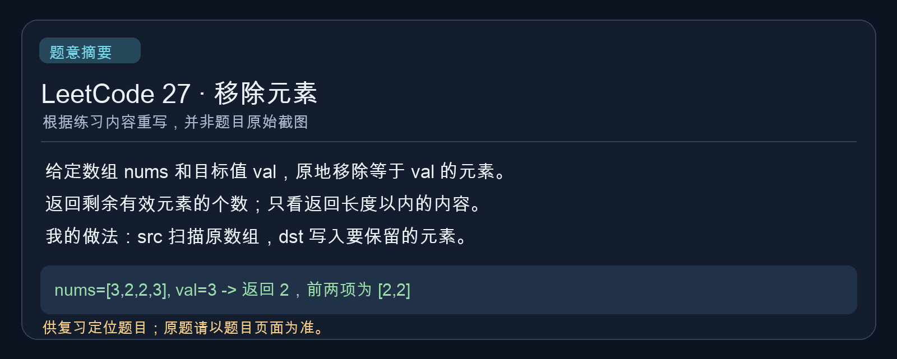

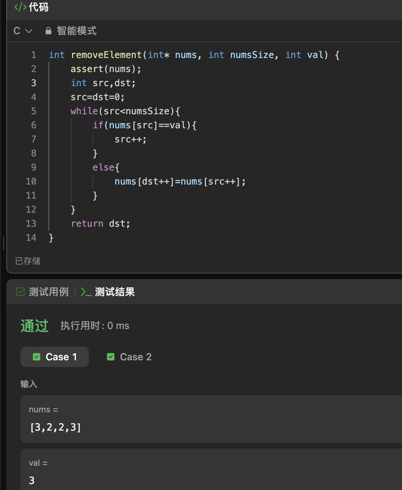

我用 `src` 扫描原数组，用 `dst` 记录下一个有效元素该放的位置。历史上写错的条件是：

```c
// 错误写法：先计算 src == val，结果只会是 0 或 1
if (nums[src == val])

// 正确写法：比较当前元素的值与 val
if (nums[src] == val)
```

所以错误写法实际只会访问 `nums[0]` 或 `nums[1]`。截图中的条件已经写对。复习版完整代码：

```c
int removeElement(int* nums, int numsSize, int val)
{
    int src = 0;
    int dst = 0;
    while (src < numsSize)
    {
        if (nums[src] == val)
            src++;
        else
            nums[dst++] = nums[src++];
    }
    return dst;
}
```

## 六、我的高频疑问 FAQ

| 疑问 | 现在的回答 |
| --- | --- |
| `phead` 是头节点吗？ | 不是，是保存首节点地址的头指针变量。 |
| `pphead` 是什么？ | 保存头指针变量地址的二级指针。 |
| 为什么 `phead = newnode` 改不了外面的 `plist`？ | `phead` 只是地址值副本。 |
| 为什么 `*pphead = newnode` 可以？ | `*pphead` 指向调用者真正的 `plist`。 |
| `pos->next` 也是指针，为什么一级指针够？ | 改的是真实节点的 `next` 成员。 |
| `free(pos)` 为什么不用二级指针？ | `free` 只需要待释放内存的地址。 |
| 什么时候需要二级指针？ | 要在函数里改变调用者的指针变量，且不通过返回值交回新值时。 |
| 为什么头删常用二级指针？ | 要让外面的头指针改指向第二个节点。 |
| 销毁链表能用一级指针吗？ | 能释放全部节点，但不会自动清空外面的头指针。 |

## 七、考前速记

1. `phead` 保存第一个节点的地址；它不是节点本身。
2. `*phead` 是第一个节点本身，前提是 `phead` 有效。
3. `&phead` 是指针变量 `phead` 自己的地址。
4. `pphead` 通常保存头指针变量的地址。
5. `*pphead` 就是调用者的头指针变量。
6. `phead = xxx` 只改函数内部的指针副本。
7. `*pphead = xxx` 能改调用者的头指针。
8. `pos->next = xxx` 改真实节点的成员，一级指针够。
9. 局部指针不代表它指向的内存也是局部的。
10. `free(pos)` 不需要二级指针。
11. `free(pos); pos = NULL;` 不会清空调用者的指针。
12. 头插、头删都要特别留意头指针变化。
13. 删除中间节点通常改 `prev->next`。
14. 一级指针能销毁所有节点，但外面的头指针会悬空。
15. 空链表就是头指针为 `NULL`。
16. 顺序表下标访问 `O(1)`；单链表按位置访问通常 `O(n)`。
17. `nums[l2]--` 减的是元素，`nums[l2--]` 减的是下标。
18. `nums[src == val]` 先比较，再拿 `0/1` 当下标。
19. 改节点的 `next` 前，先想好是否要保存后继地址。
