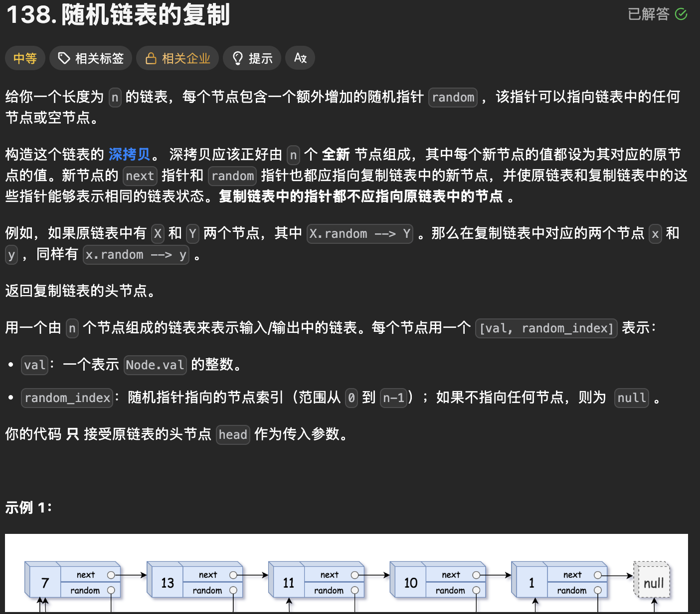
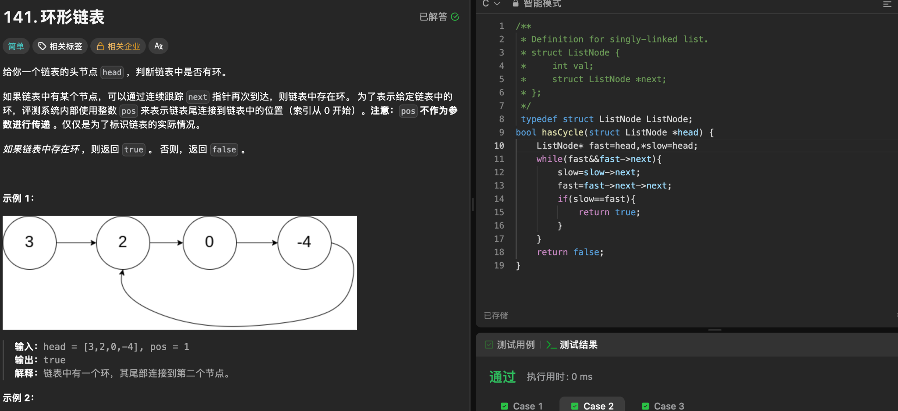
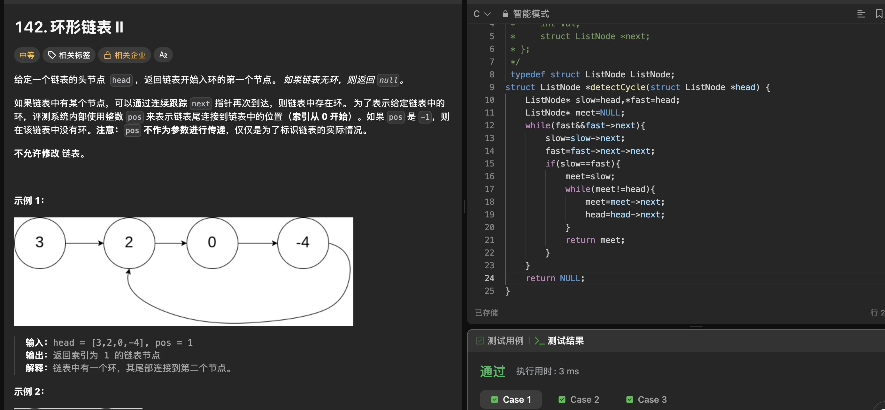

# 链表 OJ：随机链表复制与环形链表

这篇是我复习链表时整理的三道 OJ 题：138 练习复制 `random` 指针，141 判断有没有环，142 在有环的基础上找入口。代码保留我提交时的写法，只调整了排版。

## 1. LeetCode 138 随机链表的复制

### 题目



每个节点除了 `next`，还有一个可能指向任意节点或 `NULL` 的 `random`。要新建一条深拷贝链表：节点的值和指针关系相同，但复制链表中的指针不能指回原节点。

### 核心思路

把复制节点紧跟在原节点后面插入：

```text
原链表： A -> B -> C
交叉插入：A -> A' -> B -> B' -> C -> C'
```

这样，原节点 `cur` 的复制节点就是 `cur->next`。如果 `cur->random` 指向原节点 `X`，那么 `X` 后面的 `cur->random->next` 就是 `X` 的复制节点，可以赋给 `copy->random`。最后把复制节点串成新链表，并恢复原链表。

### 我的代码

```c
/**
 * Definition for a Node.
 * struct Node {
 *     int val;
 *     struct Node *next;
 *     struct Node *random;
 * };
 */
typedef struct Node Node;
struct Node* copyRandomList(struct Node* head) {
    Node* cur = head;
    while (cur) {
        Node* copy = (Node*)malloc(sizeof(Node));
        copy->val = cur->val;
        copy->next = cur->next;
        cur->next = copy;
        cur = copy->next;
    }
    cur = head;
    // 处理 random
    while (cur) {
        Node* copy = cur->next;
        if (cur->random == NULL) {
            copy->random = NULL;
        }
        else {
            copy->random = cur->random->next;
        }
        cur = copy->next;
    }
    // 把复制链表拿下来
    cur = head;
    Node* copyhead = NULL, *copytail = NULL;
    while (cur) {
        Node* copy = cur->next;
        Node* next = copy->next;
        if (copytail == NULL) {
            copyhead = copytail = copy;
        }
        else {
            copytail->next = copy;
            copytail = copytail->next;
        }
        cur->next = next;
        cur = copy->next;
    }
    return copyhead;
}
```

### 重点知识点与易错点

- **为什么交叉插入？** 它利用 `next` 建立了“原节点 → 复制节点”的对应关系：每个原节点的下一个节点就是自己的副本，因此不用另建映射表。
- **`random` 的关键一行：** `copy->random = cur->random->next;`。先通过 `cur->random` 找到它指向的原节点，再走一步 `next` 找到那个节点的副本。**必须先判断 `cur->random` 是否为 `NULL`**，否则会访问空指针。
- **插入顺序不能换：** 先让 `copy->next = cur->next` 保存后续原节点，再让 `cur->next = copy`。若先覆盖 `cur->next`，就可能找不回后面的链表。
- **拆分时别只顾新链表。** `next = copy->next` 保存当前原节点的下一个原节点；`cur->next = next` 恢复原链表。随后把 `copy` 接到复制链表，并继续处理 `next`。我这份代码用 `cur = copy->next` 前进，此时 `copy->next` 仍保存着那个原节点。

**复杂度：** 时间 `O(n)`；额外辅助空间 `O(1)`。新建的 `n` 个复制节点是题目要求的结果，不计入辅助空间。

## 2. LeetCode 141 环形链表

### 题目



给定链表头节点，判断沿 `next` 走下去会不会再次到达某个节点。有环返回 `true`，无环返回 `false`。题目里的 `pos` 只是评测系统描述“尾节点连回哪里”的方式，**不会传进函数**。

### 核心思路

使用快慢指针：`slow` 每次走一步，`fast` 每次走两步。有环时，两者进入环后会相遇；没有环时，`fast` 会走到链表末尾。

### 我的代码

```c
/**
 * Definition for singly-linked list.
 * struct ListNode {
 *     int val;
 *     struct ListNode *next;
 * };
 */
typedef struct ListNode ListNode;
bool hasCycle(struct ListNode *head) {
    ListNode* fast = head, *slow = head;
    while (fast && fast->next) {
        slow = slow->next;
        fast = fast->next->next;
        if (slow == fast) {
            return true;
        }
    }
    return false;
}
```

### 重点知识点与易错点

- **循环条件要同时检查 `fast` 和 `fast->next`：** `while (fast && fast->next)`。只检查 `fast`，下一句 `fast->next->next` 就可能对空指针取 `next`。`&&` 会从左到右短路判断。
- **`pos` 不是参数。** 函数只接收 `head`，靠指针是否再次相遇判断有环。
- **第一次 `slow == fast` 只说明有环。** 相遇点通常不是环入口；141 到这里就可以返回 `true`，找入口要看下一题。

**复杂度：** 时间 `O(n)`，空间 `O(1)`。

## 3. LeetCode 142 环形链表 II

### 题目



这次要返回环的**入口节点**；没有环返回 `NULL`。题目要求不修改链表，`pos` 仍只是测试数据的说明，并非函数参数。

### 核心思路

第一阶段与 141 相同：`slow` 一步、`fast` 两步，先找到环内第一次相遇点。第二阶段让 `meet` 从相遇点出发，让 `head` 从链表头出发，**两个指针都每次走一步**；再次相遇的位置就是环入口。

### 我的代码

```c
/**
 * Definition for singly-linked list.
 * struct ListNode {
 *     int val;
 *     struct ListNode *next;
 * };
 */
typedef struct ListNode ListNode;
struct ListNode *detectCycle(struct ListNode *head) {
    ListNode* slow = head, *fast = head;
    ListNode* meet = NULL;
    while (fast && fast->next) {
        slow = slow->next;
        fast = fast->next->next;
        if (slow == fast) {
            meet = slow;
            while (meet != head) {
                meet = meet->next;
                head = head->next;
            }
            return meet;
        }
    }
    return NULL;
}
```

### 重点知识点与易错点

- **第一次相遇点不是环入口。** 这是 141 与 142 最容易混淆的地方：141 到此只需判断有环；142 还要执行第二阶段。
- **第二阶段从两个位置出发，速度相同。** `meet` 从相遇点走，`head` 从链表头走，两者每次各走一步，不能让 `fast` 继续一次走两步。
- **`head = head->next` 没有改链表。** 它只移动函数里的局部指针变量；像 `node->next = xxx` 才会修改节点间的链接。
- **无环要返回 `NULL`。** `fast` 无法继续走两步时，循环结束并执行最后的 `return NULL;`。`pos` 同样不参与函数计算。

#### 为什么 `head` 和 `meet` 会在入口相遇？

设链表头到环入口有 `a` 步，入口沿 `next` 到第一次相遇点有 `b` 步，环一圈有 `C` 步。

第一次相遇时，`slow` 走了 `a + b` 步；`fast` 速度是它的两倍，并且比它多绕了整数圈。设多绕 `k` 圈（`k >= 1`）：

```text
slow：a + b
fast：a + b + kC = 2(a + b)
所以：a + b = kC
      a = (k - 1)C + (C - b)
```

`C - b` 正是从**相遇点继续沿 `next` 走到入口**所需的步数；多走整圈仍会回到入口。因此，从相遇点出发的 `meet` 走 `a` 步会到入口，从链表头出发的 `head` 走 `a` 步也刚好到入口。第二阶段两者每轮各走一步，便会在那里相遇。

它们也不会在入口之前碰面：`head` 在走完这 `a` 步之前还在环外，`meet` 始终在环内。代码中的 `while (meet != head)` 正是在等待这次相遇，随后 `return meet` 返回入口节点。

**复杂度：** 时间 `O(n)`，空间 `O(1)`。

# 三道题总结

| 题目 | 核心方法 | 主要考点 |
| --- | --- | --- |
| 138 随机链表的复制 | 复制节点交叉插入 | `random` 指针、链表拆分 |
| 141 环形链表 | 快慢指针 | 判断链表是否有环 |
| 142 环形链表 II | 快慢指针 + 二次相遇 | 找环入口 |

复习时记住三个技巧：利用链表结构建立原节点与复制节点的对应关系；用快慢指针判断环；首次相遇后让“头节点 + 相遇点”同步移动找入口。**141 的第一次相遇只用来确认有环；142 的第一次相遇只是第二阶段的起点。**
