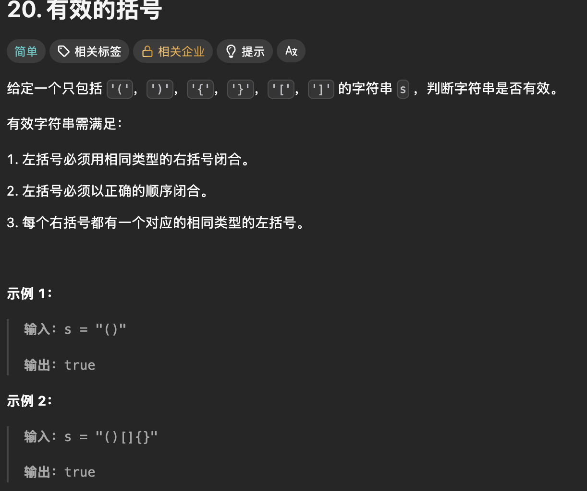

# 栈的顺序表实现与 LeetCode 20 有效的括号：从扩容到配对判断

我正在学习栈和队列。这篇先记录已经写出来的**顺序栈**、`test.c` 中的练习，以及用这个栈做的 LeetCode 20「有效的括号」。本文保留我当时的原代码，包括注释掉的练习和函数命名不一致的地方；后面单独说明问题与最小修正，便于复习时看到真实的思考过程。这里没有队列的实现代码，所以不把栈误写成队列。

## 一、先认清这个栈：`a`、`top`、`capacity`

`ST` 用动态数组保存数据。`a` 指向数组起始位置；`capacity` 表示已经申请到的**元素个数**；`top` 表示目前已有的**有效元素个数**，同时也是下一个元素应该写入的下标。这样空栈是 `top == 0`，栈顶下标是 `top - 1`，有效范围是 `a[0]` 到 `a[top - 1]`。

| 状态 | `top` | `capacity` | 下一次入栈位置 |
| --- | ---: | ---: | --- |
| 刚初始化 | 0 | 0 | 先申请空间，再写 `a[0]` |
| 压入 1、2、3 | 3 | 4 | `a[3]` |
| 四个位置都用完 | 4 | 4 | 必须先扩容 |

这里选的是“`top` 指向下一个空位”的写法。有的教材让 `top` 指向当前栈顶，初始值便可能是 `-1`；两种约定都能用，**但入栈、出栈、判空、取栈顶必须贯彻同一种约定**。

### `Stack.h`：完整原代码

```c
#pragma once
#include <stdio.h>
#include <stdlib.h>
#include <assert.h>
#include <stdbool.h>
typedef int SLDataType;
typedef struct Stack{
    SLDataType* a;
    int top;
    int capacity;
}ST;
//初始化和销毁
void SLInit(ST* pst);
void STDestroy(ST* pst);
//入栈和出栈
void SLPush(ST* pst,SLDataType x);
void SLPop(ST* pst);
//取栈顶数据
SLDataType STTop(ST* pst);
//判空
bool STEmpty(ST* pst);
//获取数据个数
int STsize(ST * size);
```

`typedef int SLDataType;` 把栈的数据类型暂定为 `int`，所以 `a` 是 `int` 数组。`typedef struct Stack { ... } ST;` 让后续函数可以用 `ST*` 表示栈地址。`#pragma once` 防止头文件在一次编译中重复展开；四个标准头文件分别提供 `printf`/`perror`、`malloc`/`realloc`/`free`、`assert` 和 `bool`。

头文件负责**声明**，`Stack.c` 负责**定义**，`test.c` 负责**调用**。三处的函数名和参数类型必须一致；参数变量叫 `size` 还是 `pst` 不影响链接，但 `STsize(ST * size)` 中的 `size` 实际上也是一个栈指针，叫 `pst` 更不容易误解。

## 二、逐个看 `Stack.c` 的功能和用法

### `Stack.c`：完整原代码

```c
#include "Stack.h"
void SLInit(ST* pst){
    assert(pst);
    pst->a=NULL;
    pst->top=0;
    pst->capacity=0;
}
void SLDestroy(ST* pst){
    assert(pst);
    free(pst->a);
    pst->top=pst->capacity=0;
}
void SLPush(ST* pst,SLDataType x){
    assert(pst);
    //扩容
    if(pst->top==pst->capacity){
        int newcapacity=pst->capacity==0?4:pst->capacity*2;
        SLDataType* tmp=(SLDataType*)realloc(pst->a,sizeof(SLDataType)*newcapacity);
        if(tmp==NULL){
            perror("realloc fail");
            return;
        }
        pst->a=tmp;
        pst->capacity=newcapacity;
    }
    pst->a[pst->top]=x;
    pst->top++;
}
void STPop(ST* pst){
    assert(pst);
    assert(pst->top>0);
    pst->top--;
}
SLDataType STTop(ST* pst){
    assert(pst);
    assert(pst->top>0);
    return pst->a[pst->top-1];
}
bool STEmpty(ST* pst){
    assert(pst);
    return pst->top==0;
}
int STsize(ST* pst){
    assert(pst);
    return pst->top;
}
```

### `SLInit`：初始化

调用 `SLInit(&s)` 时，`&s` 是局部变量 `s` 的地址，函数通过 `pst` 修改同一个栈。`assert(pst)` 要求这个地址不为 `NULL`。随后把数组指针设为 `NULL`，把元素数和容量都设为 0。初始化后，**还没有申请数组内存**；第一次 `SLPush` 才会申请。先初始化再使用，才不会拿未初始化的野指针去 `realloc` 或 `free`。

### `SLPush`：最需要搞懂的动态扩容

入栈的顺序是：检查栈指针 → 判断空间是否已满 → 必要时申请更大的数组 → 在 `a[top]` 写入数据 → `top++`。绝不能先写入再判断是否扩容。

```text
初始：a = NULL，top = 0，capacity = 0
压入 10：0 == 0，扩到 4；写 a[0] = 10；top 变 1
再压 20、30、40：依次写 a[1]、a[2]、a[3]；top 变 4
压入 50：4 == 4，扩到 8；写 a[4] = 50；top 变 5
```

`if (pst->top == pst->capacity)` 的意思是“有效元素数等于可存元素数”，即没有空位。`pst->capacity == 0 ? 4 : pst->capacity * 2` 在第一次分配时取 4，以后每次翻倍。增长策略让多数入栈只需一次写入；偶尔扩容会复制旧元素，单次最坏 `O(n)`，连续入栈的**均摊**时间是 `O(1)`。

`realloc(pst->a, sizeof(SLDataType) * newcapacity)` 的第二个参数是**字节数**，所以必须乘 `sizeof(SLDataType)`。这里的 `newcapacity` 是“多少个元素”，并非“多少字节”。`realloc(NULL, n)` 相当于首次申请内存。已有内存时，它可能在原地址扩，也可能搬到新地址；旧数据会保留到新申请的空间中，但成功后只应使用返回的新指针。

为什么先接到 `tmp`，再写 `pst->a = tmp`？因为 `realloc` 失败会返回 `NULL`，而原内存仍归原指针所有。如果直接写 `pst->a = realloc(...)`，失败时就丢了原地址，内存泄漏。当前写法失败后调用 `perror` 并 `return`，`top` 和 `capacity` 没变，旧栈仍可使用；但 `SLPush` 返回 `void`，调用者**无法从返回值判断这次入栈是否成功**。后面的 LeetCode 解法依赖压栈成功，内存不足时可能错误地判断括号。若要把这套栈用于需要可靠错误处理的程序，应让入栈函数返回成功/失败，或采用明确的退出策略。还有一点：`capacity * 2` 和 `sizeof(...) * newcapacity` 在极大输入下应检查整数溢出，本练习代码没有做这个防护。

扩容成功后先更新 `a` 和 `capacity`，再执行 `pst->a[pst->top] = x; pst->top++;`。写入时 `top` 仍是下一个空位的下标；自增后它又恢复为有效元素个数。这里**不能先 `top++` 再用 `a[top]`**，否则第一次入栈就会跳过 `a[0]`。

### `SLDestroy`：销毁

`free(pst->a)` 归还动态数组，`free(NULL)` 也是安全的。之后把 `top`、`capacity` 清零。当前代码**没有把 `pst->a` 设回 `NULL`**，因此留下悬空指针：销毁后若再次调用 `SLDestroy`，或者不重新初始化就入栈，都可能出错。最小修正是在 `free` 后补 `pst->a = NULL;`。不过本文原代码保持不动，提醒自己按现状只能销毁一次、销毁后不再使用。

### `STPop`、`STTop`、`STEmpty`、`STsize`

- `STPop(&s)` 只让 `top--`，逻辑上删掉栈顶，不必清空数组里的旧值；下一次入栈会覆盖它。`assert(pst->top > 0)` 表示空栈不能出栈。函数定义是 `STPop`，头文件却声明成 `SLPop`，必须统一。
- `STTop(&s)` 返回 `a[top - 1]`，但**不删除**元素；所以通常先读栈顶，再调用 `STPop`。空栈时不能读取，函数用断言阻止这种调用。
- `STEmpty(&s)` 在 `top == 0` 时返回 `true`。遍历出栈时可以写 `while (!STEmpty(&s))`。
- `STsize(&s)` 返回有效元素个数 `top`，并非容量。头文件中参数名 `size` 没有改变函数类型，但建议改成 `pst` 便于阅读。

`assert` 只适合检查“调用者本不该犯的错误”。开启 `NDEBUG` 时断言可能被编译掉，所以不能把它当成正式的空栈错误处理。调用 `STTop`/`STPop` 前仍要确保非空。

## 三、`test.c`：完整原代码与实际执行顺序

```c
#include<stdio.h>
#include<stdlib.h>
//
//int main()
//{
//	// 原地扩容
//	// 异地扩容
//	int* p1 = (int*)malloc(8);
//	printf("%p\n", p1);
//
//	int* p2 = (int*)realloc(p1, 80);
//	printf("%p\n", p2);
//
//	free(p2);
//
//
//	int i = 0;
//	int ret1 = ++i;
//
//	int ret2 = i++;
//
//
//
//	return 0;
//}

#include"Stack.h"

//int main()
//{
//	ST s;
//	STInit(&s);
//	STPush(&s, 1);
//	STPush(&s, 2);
//	STPush(&s, 3);
//	STPush(&s, 4);
//
//	printf("%d\n", STTop(&s));
//	STPop(&s);
//	printf("%d\n", STTop(&s));
//	STPop(&s);
//	STPop(&s);
//	STPop(&s);
//	STPop(&s);
//
//	//printf("%d\n", STTop(&s));
//
//	STDestroy(&s);
//
//	return 0;
//}

int main()
{
	// 入栈：1 2 3 4
	// 出栈：4 3 2 1  /  2 4 3 1
	ST s;
	STInit(&s);
	STPush(&s, 1);
	STPush(&s, 2);

	printf("%d ", STTop(&s));
	STPop(&s);

	STPush(&s, 3);
	STPush(&s, 4);

	while (!STEmpty(&s))
	{
		printf("%d ", STTop(&s));
		STPop(&s);
	}

	STDestroy(&s);
}
```

这份文件有三段练习。第一段已注释的 `malloc`/`realloc` 用来观察**原地扩容和异地扩容**：两个地址是否相同都可能发生，不能预设一定原地扩。它没有检查分配失败，也没有展示失败时原指针仍有效的处理方式，所以更适合作概念练习。`++i` 是先自增再作为表达式的值，`i++` 是先取旧值再自增；从 `i = 0` 开始，`ret1 = 1`，随后 `ret2 = 1`、`i = 2`。

第二段已注释的 `main` 演示连续入栈、读栈顶、出栈。其中入了 4 个元素却调用了 **5 次** `STPop`；若解除注释并按一致的函数名编译，最后一次会对空栈出栈，触发断言。它还提醒我们：`STTop` 不等于出栈，读完若想删除仍须 `STPop`。

当前实际的 `main` 先入栈 `1`、`2`，输出并弹出 `2`；再入栈 `3`、`4`，循环输出并弹出 `4`、`3`、`1`。所以按预期顺序输出是 **`2 4 3 1`**，这是一种合法的栈出栈序列。`4 3 2 1` 对应四个元素都先入栈再连续出栈，是另一种操作顺序。循环判空避免了对空栈调用 `STTop`，最后 `STDestroy` 负责释放数组。

### 这份原代码为什么目前编译不过？

我用 C11 的编译检查核对了磁盘上的原文件，`test.c` 的 `STInit`、`STPush`、`STPop` 找不到相应声明。名字对应关系如下：

| 调用处 | 头文件声明 | `Stack.c` 定义 | 最小统一方式 |
| --- | --- | --- | --- |
| `STInit` | `SLInit` | `SLInit` | 调用处改成 `SLInit` |
| `STPush` | `SLPush` | `SLPush` | 调用处改成 `SLPush` |
| `STPop` | `SLPop` | `STPop` | 头文件改声明为 `STPop` |
| `STDestroy` | `STDestroy` | `SLDestroy` | 定义改名为 `STDestroy`，或声明/调用统一为 `SLDestroy` |

还要注意，注释掉的第二段 `main` 也使用 `STInit`/`STPush`，将来解除注释时同样需要统一；程序只能保留**一个**有效的 `main`。上表只是说明如何对齐名称，没有修改下面保存的原文件。即使先解决当前的“未声明函数”，链接阶段仍会因 `STDestroy` 的定义名不一致而失败。

## 四、LeetCode 20「有效的括号」

### 题目截图与要求



题目给一个只包含 `()`、`[]`、`{}` 的字符串，判断每个左括号能否按**类型相同、顺序正确**的规则闭合。空字符串也符合“没有不匹配括号”的条件，结果为 `true`。截图中的 `"()"` 和 `"()[]{}"` 都返回 `true`。题目保证只有这六种字符，因此下面代码中的 `else` 可把非左括号视为右括号；若用于普通文本，就必须另外判断字符是否真是 `)`、`]`、`}`。

### 我的 LeetCode 代码（保留原写法）

下面是我最初发来的实现，整理了换行与缩进，函数名和判断逻辑照原样保留。它同时包含栈结构、栈操作和 `isValid`，便于单独复盘题解。若和上面的本地三个文件一起编译，会重复定义栈函数；它是**另一份题解代码展示**，不是要直接拼进同一个 C 工程。这份题解原文没有写标准库头文件，若单独编译，需要补上 `assert.h`、`stdbool.h`、`stdio.h`、`stdlib.h`；这里的 `SLDataType` 是 `int`，可以容纳这些 ASCII 括号字符；`STTop` 返回后再赋给 `char` 用于比较。

```c
typedef int SLDataType;
typedef struct Stack{
    SLDataType* a;
    int top;
    int capacity;
}ST;

void SLInit(ST* pst){
    assert(pst);
    pst->a=NULL;
    pst->top=0;
    pst->capacity=0;
}

void SLDestroy(ST* pst){
    assert(pst);
    free(pst->a);
    pst->top=pst->capacity=0;
}

void SLPush(ST* pst,SLDataType x){
    assert(pst);
    //扩容
    if(pst->top==pst->capacity){
        int newcapacity=pst->capacity==0?4:pst->capacity*2;
        SLDataType* tmp=(SLDataType*)realloc(pst->a,sizeof(SLDataType)*newcapacity);
        if(tmp==NULL){
            perror("realloc fail");
            return;
        }
        pst->a=tmp;
        pst->capacity=newcapacity;
    }
    pst->a[pst->top]=x;
    pst->top++;
}

void STPop(ST* pst){
    assert(pst);
    assert(pst->top>0);
    pst->top--;
}

SLDataType STTop(ST* pst){
    assert(pst);
    assert(pst->top>0);
    return pst->a[pst->top-1];
}

bool STEmpty(ST* pst){
    assert(pst);
    return pst->top==0;
}

int STsize(ST* pst){
    assert(pst);
    return pst->top;
}

bool isValid(char* s) {
    ST st;
    SLInit(&st);
    while(*s){
        if(*s=='('||*s=='['||*s=='{'){
            SLPush(&st,*s);
        }
        else{
            if(STEmpty(&st)){
                SLDestroy(&st);
                return false;
            }
            char top=STTop(&st);
            STPop(&st);
            if((top=='(' && *s!=')') ||
               (top=='[' && *s!=']') ||
               (top=='{' && *s!='}')){
                SLDestroy(&st);
                return false;
            }
        }
        ++s;
    }
    bool ret = STEmpty(&st);
    SLDestroy(&st);
    return ret;
}
```

### 为什么必须用栈？

遇到左括号就先记住，遇到右括号时必须匹配**最近一个还未闭合的左括号**。这正是栈“后进先出”：最后入栈的左括号，最先接受检查。比如 `([{}])`：依次压入 `(`、`[`、`{`，随后 `}` 配 `{`，`]` 配 `[`，`)` 配 `(`。如果只统计每类括号数量，`([)]` 虽然数量相等也会被误判为合法；用栈会发现读到 `)` 时栈顶是 `[`，当场返回 `false`。

### `isValid` 的执行过程

1. `ST st; SLInit(&st);` 创建并初始化一个空栈，用它只保存**尚未配对的左括号**。
2. `while (*s)` 逐字符扫描，直到遇到字符串结尾的 `\0`。`++s` 让指针移到下一个字符；本题的 `s` 是 LeetCode 传入的字符串首地址。
3. 如果是 `(`、`[`、`{`，`SLPush(&st, *s)` 入栈，等待未来的右括号。
4. 否则遇到右括号时，先用 `STEmpty` 判断是否已有可匹配的左括号。没有就先 `SLDestroy` 再返回 `false`，例如输入 `")("` 在第一个字符就失败。
5. 非空时取出 `top = STTop(&st)`，然后 `STPop(&st)`。三个条件分别检查 `(` 对 `)`、`[` 对 `]`、`{` 对 `}`；任一对不匹配，就销毁栈并返回 `false`。
6. 字符全部扫描完后还要检查 `STEmpty(&st)`。例如 `"(("` 没出现错误右括号，但仍有未闭合左括号，应返回 `false`。先把判断结果存进 `ret`，销毁栈后再返回它。

| 输入 | 关键一步 | 结果 |
| --- | --- | --- |
| `"()[]{}"` | 每个右括号都配当前栈顶，最后为空 | `true` |
| `"([{}])"` | 闭合顺序 `{`、`[`、`(` | `true` |
| `"([)]"` | 读到 `)` 时栈顶是 `[` | `false` |
| `"(]"` | `(` 与 `]` 类型不一致 | `false` |
| `"(()"` | 扫描完还有 `(` 留在栈里 | `false` |
| `")("` | 第一个右括号到来时栈为空 | `false` |

### 题解的易错点

- **错误写法：只比较左右括号的数量。** 为什么错：数量相同不保证顺序；`([)]` 就是反例。正确写法：右括号只与当前栈顶的左括号比较。以后判断：题目出现“最近一个未匹配项”时，先想栈。
- **错误写法：读到右括号先调用 `STTop`。** 为什么错：输入从右括号开始时会在空栈取栈顶，触发断言。正确写法：先 `STEmpty`，再取栈顶。以后判断：任何需要栈顶的操作，先证明栈非空。
- **错误写法：扫描结束直接返回 `true`。** 为什么错：`"(("` 没遇到错误右括号，但左括号没闭合。正确写法：结果取决于最终 `STEmpty(&st)`。
- **错误写法：匹配失败直接返回。** 为什么错：`st.a` 可能已申请内存，会泄漏。正确写法：每条提前返回路径先销毁栈；正常路径也要销毁。
- **当前实现的额外限制：** `SLPush` 分配失败只是打印错误并返回 `void`，`isValid` 不知道压栈失败，可能给出错误结果；`SLDestroy` 释放后未清空 `a`。这两点是栈接口本身的问题，不是配对思路的问题。

扫描一次字符串，设长度为 `n`：时间 `O(n)`，最坏情况下所有字符都是左括号，辅助空间 `O(n)`。这里的栈按 4、8、16……扩容，均摊入栈仍是常数时间。若空间分配失败，当前实现并不保证正确返回值；复杂度分析默认分配成功。

## 五、复习时记住

栈的关键约定是 `top` 表示“下一个空位”，因此入栈写 `a[top]` 后 `top++`，出栈只需 `top--`，取栈顶用 `a[top - 1]`。`SLPush` 的关键是**先判断是否满、用临时指针接 `realloc`、成功后更新地址和容量、最后写入并自增**。括号题的关键是**右括号只配最近的左括号**，而且必须处理空栈、类型不符、扫描完仍有剩余三类情况。多文件练习还提醒我：头文件声明、实现定义、调用名称要逐个对齐，不能只看算法思路就以为程序已经能编译。
